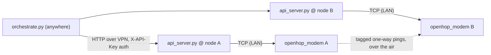

# mc-rf-sweep

Over-the-air LoRa link-quality testing for MeshCore-style mesh networks.
Two fixed radio nodes, one scripted sweep, comparable results across
regions and meshes — with the long-term goal of finding out whether one
frequency is reliably best *everywhere*.

Each node's API server owns its modem TCP connection and can reconfigure
the radio live — frequency, SF, BW, CR, TX power, preamble — with no
reboot. The orchestrator sweeps parameters across the 902–928 MHz ISM
band (or any band), measures per-packet delivery, SNR, and one-way
latency, and produces plots + reports you can share here.

## Repository layout

| Path | What it is |
|---|---|
| [`kit/`](kit/) | The generic test tool: API server, orchestrator, analyzer, plotter, methodology |
| [`results/`](results/) | Per-mesh test reports. Start with [`results/TEMPLATE.md`](results/TEMPLATE.md) |
| [`results/SUMMARY.md`](results/SUMMARY.md) | Cross-mesh comparison table — one row per campaign |

## Quick start

1. **Two nodes, two computers.** Each computer runs `kit/api_server.py`
   next to an openhop_modem reachable over TCP (default port 5055).
   The two computers need to reach each other (VPN is easiest). See
   [`kit/README.md`](kit/README.md) for full setup.

       cp kit/env/node_a.env.example node_a.env   # edit values
       python kit/api_server.py --env node_a.env  # on node A's computer
       python kit/api_server.py --env node_b.env  # on node B's computer

2. **Run the standard band sweep** (the campaign this repo is built
   around — 51 frequencies × SF7–12 at 500 kHz BW, ~4.5–5 h):

       cd kit
       python orchestrate.py \
         --mode oneway --bw 500 --cr 5 --tx 22 --preamble 32 --payload-len 40 \
         --trials 20 --trial-delay 0.5 --settle 3 \
         --vary freq=$(python3 -c "print(','.join(f'{902.5+i*0.5:.1f}' for i in range(51)))") \
         --vary sf=7,8,9,10,11,12

3. **Run the US-defaults baseline** (~4 min) so your results have a
   familiar reference point:

       python orchestrate.py \
         --mode oneway --freq 910.525 --bw 62.5 --sf 7 --cr 5 \
         --tx 22 --preamble 32 --payload-len 40 \
         --trials 100 --trial-delay 0.5 --settle 3

4. **Analyze and plot:**

       python analyze.py results/<timestamp>
       python make_plots.py results/<timestamp> [results/<baseline>] \
         --title "YourMesh, your nodes, date" \
         --node-a "NodeA" --node-b "NodeB" --fig-format svg,png

5. **Publish.** Copy the results directory into
   `results/<your-mesh>/<date-campaign>/`, write it up following
   [`results/TEMPLATE.md`](results/TEMPLATE.md), add a row to
   [`results/SUMMARY.md`](results/SUMMARY.md), and open a PR.

## Why the same standard test matters

Interference is local, but it is not *random* — 902–928 MHz occupancy
(Wi-Fi hopper backlobes, ISM gear, RFID) has strong regional patterns.
If every mesh runs the same standard sweep with the same trial counts,
we can line the plots up side by side and ask: is there a frequency that
is good for everyone on average, or does every region need its own
choice? Either answer is valuable. One campaign per mesh answers it for
your region.

## Status

- **NebraskaMesh (Bellevue, NE)** — first campaign published:
  [`results/nebraskamesh/`](results/nebraskamesh/).
- Fine-sweep and diurnal campaigns: in progress.

## License

MIT — see [LICENSE](LICENSE).
