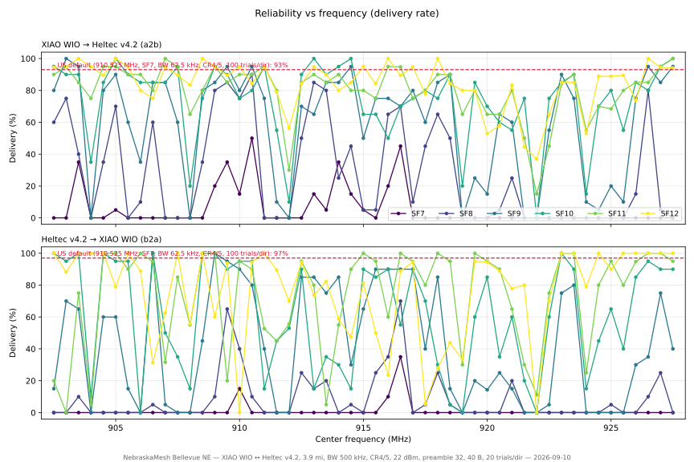
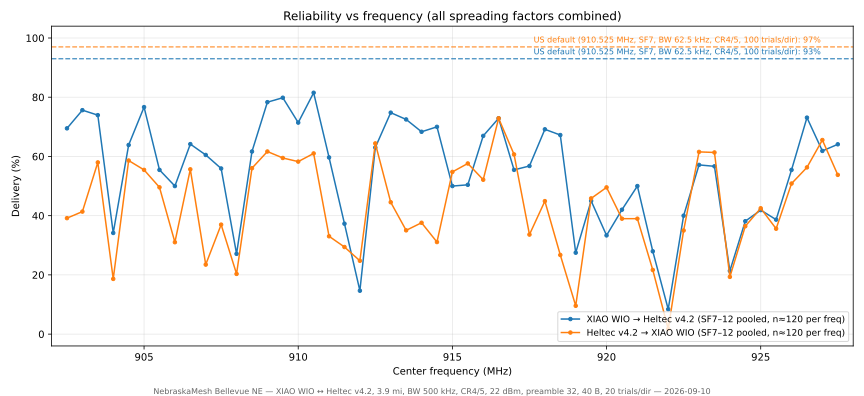
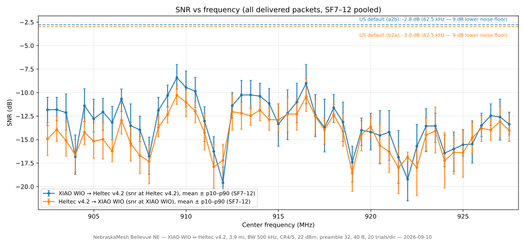
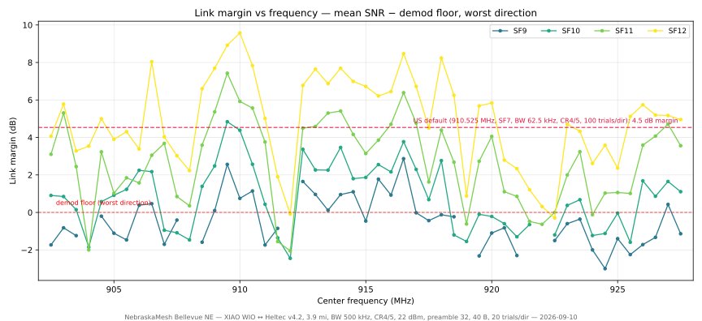
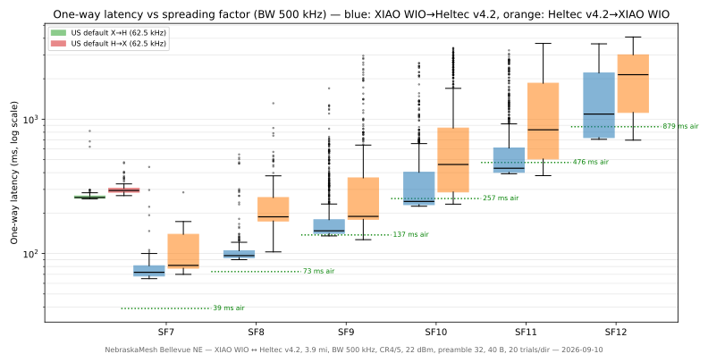

# 902–928 MHz band sweep — 500 kHz BW, SF7–12 (plus US-defaults baseline)

**Mesh:** NebraskaMesh · **Date:** 2026-09-10 · **Location:** Bellevue, NE, USA
**Path:** indoor XIAO WIO ↔ gazebo Heltec v4.2, ~3.9 mi — see the [mesh README](../README.md)

## TL;DR

- **Best frequencies (worst-direction SF9–10 delivery):** 909.5, 909.0, 906.5,
  910.5, 923.0, 927.0. A spread-out finalist set across the whole band:
  **903.0 · 906.5 · 909.5 · 917.0 · 923.0 · 927.0**.
- **Dead zones:** 904.0, 908.0, 911.5–912.0, 919.0, 921.5–922.0, 924.0 and
  925.5 are unusable; **922.0 delivered 0/240 packets at every SF**.
- **The link is link-budget-limited:** SF7 is ~3.5% and SF8 ~18% pooled
  across the band; only SF10–12 are practical at 500 kHz. SF12 tops out
  at ~81% pooled.
- **US defaults (910.525 MHz, 62.5 kHz, SF7) baseline: 93%/97% delivery**
  — the 9 dB quieter 62.5 kHz channel more than pays for SF7's weak
  processing gain, at ~1/10–1/30th the throughput of 500 kHz options.
- The outdoor node hears the indoor node's transmissions fine, but the
  indoor node (b2a direction) is consistently ~2–4 dB worse.

## Test setup

| | Node A (initiator) | Node B |
|---|---|---|
| Hardware | Seeed XIAO WIO, openhop_modem firmware | Heltec v4.2, openhop_modem firmware |
| Antenna | DIY quarter-wave ground plane | Muziworks whip (hung upside down) |
| Placement | Indoors, dresser, 2nd floor (~15 ft AGL) | Outdoors under gazebo (~6 ft AGL) |
| TX power | 22 dBm | 22 dBm |

Path length ~3.9 mi (6.3 km), suburban residential. Both modems driven by
`api_server.py` over a home VPN; one orchestrator scripted everything.

## Method

Two runs, same session:

1. **Band sweep** — 51 center frequencies (902.5–927.5 MHz, 0.5 MHz grid,
   500 kHz channels non-overlapping) × SF7–12, oneway mode, 20 trials per
   direction per combination (≈244 packets/frequency), payload 40 B,
   CR4/5, 22 dBm, preamble 32. Ran 10:40–15:30 CDT (≈4.8 h).

```
python orchestrate.py \
  --mode oneway --bw 500 --cr 5 --tx 22 --preamble 32 --payload-len 40 \
  --trials 20 --trial-delay 0.5 --settle 3 \
  --vary freq=902.5,903.0,...,927.5 --vary sf=7,8,9,10,11,12
```

2. **US-defaults baseline** — 910.525 MHz, BW 62.5 kHz, SF7, CR4/5,
   100 trials/direction, 15:39–15:42 CDT.

```
python orchestrate.py \
  --mode oneway --freq 910.525 --bw 62.5 --sf 7 --cr 5 \
  --tx 22 --preamble 32 --payload-len 40 \
  --trials 100 --trial-delay 0.5 --settle 3
```

Noise floors were sampled per combination at both nodes; clock offset was
measured per combination (±6 ms NTP-derived).

## Results

### Full delivery ladder (a2b/b2a, out of 20 sent per cell)

| Frequency (MHz) | SF7 | SF8 | SF9 | SF10 | SF11 | SF12 |
|---:|---|---|---|---|---|---|
| 902.5 | 0/0 | 12/0 | 16/3 | 19/20 | 18/4 | 17/20 |
| 903.0 | 0/0 | 15/0 | 20/14 | 18/19 | 18/0 | 19/15 |
| 903.5 | 7/0 | 8/2 | 19/13 | 18/20 | 17/15 | 19/19 |
| 904.0 | 0/0 | 0/0 | 0/0 | 7/2 | 15/1 | 19/19 |
| 904.5 | 0/0 | 7/0 | 16/12 | 17/20 | 19/20 | 17/16 |
| 905.0 | 1/0 | 14/0 | 18/12 | 20/19 | 19/20 | 20/15 |
| 905.5 | 0/0 | 0/0 | 12/3 | 18/19 | 18/18 | 18/18 |
| 906.0 | 0/0 | 2/0 | 7/0 | 17/0 | 18/20 | 16/16 |
| 906.5 | 0/0 | 12/1 | 17/20 | 17/20 | 16/18 | 15/5 |
| 907.0 | 0/0 | 0/0 | 17/1 | 17/10 | 20/6 | 18/10 |
| 907.5 | 0/0 | 0/0 | 12/0 | 19/7 | 18/17 | 17/20 |
| 908.0 | 0/0 | 0/0 | 0/0 | 4/3 | 13/11 | 15/10 |
| 908.5 | 0/0 | 7/0 | 16/9 | 15/20 | 16/20 | 20/16 |
| 909.0 | 4/0 | 16/2 | 17/20 | 19/20 | 19/20 | 19/12 |
| 909.5 | 7/0 | 17/13 | 19/19 | 18/18 | 17/4 | 17/15 |
| 910.0 | 3/3 | 15/8 | 16/18 | 15/19 | 18/19 | 18/0 |
| 910.5 | 10/0 | 18/2 | 19/16 | 16/19 | 18/18 | 16/17 |
| 911.0 | 0/0 | 0/0 | 15/8 | 19/3 | 19/10 | 18/17 |
| 911.5 | 0/0 | 0/0 | 2/0 | 11/9 | 16/9 | 15/17 |
| 912.0 | 0/0 | 0/0 | 0/0 | 2/9 | 6/10 | 9/7 |
| 912.5 | 0/0 | 10/5 | 14/17 | 18/18 | 17/19 | 16/17 |
| 913.0 | 3/0 | 17/3 | 13/17 | 20/3 | 18/16 | 18/14 |
| 913.5 | 1/0 | 16/4 | 17/15 | 18/7 | 17/1 | 18/14 |
| 914.0 | 7/0 | 5/0 | 17/17 | 19/6 | 18/11 | 16/10 |
| 914.5 | 3/0 | 9/1 | 19/6 | 20/3 | 16/18 | 17/9 |
| 915.0 | 1/0 | 1/0 | 10/13 | 13/18 | 16/19 | 19/13 |
| 915.5 | 0/0 | 1/5 | 15/18 | 13/17 | 15/19 | 16/9 |
| 916.0 | 4/2 | 13/7 | 15/18 | 10/18 | 19/12 | 18/4 |
| 916.5 | 9/7 | 14/14 | 14/18 | 14/11 | 18/20 | 17/16 |
| 917.0 | 0/0 | 2/0 | 16/18 | 15/18 | 15/18 | 18/17 |
| 917.5 | 0/0 | 9/1 | 12/8 | 16/14 | 16/16 | 14/1 |
| 918.0 | 0/0 | 13/5 | 17/17 | 15/6 | 18/20 | 20/5 |
| 918.5 | 0/0 | 10/1 | 18/3 | 18/1 | 18/19 | 16/7 |
| 919.0 | 0/0 | 0/0 | 0/0 | 4/0 | 13/6 | 16/5 |
| 919.5 | 0/0 | 0/0 | 5/4 | 17/12 | 16/20 | 16/19 |
| 920.0 | 0/0 | 0/0 | 3/2 | 14/17 | 13/19 | 9/17 |
| 920.5 | 0/0 | 1/0 | 13/5 | 12/7 | 13/18 | 11/16 |
| 921.0 | 0/0 | 5/4 | 12/3 | 11/12 | 16/13 | 15/14 |
| 921.5 | 0/0 | 0/0 | 0/0 | 15/4 | 10/6 | 8/16 |
| 922.0 | 0/0 | 0/0 | 0/0 | 0/0 | 3/2 | 7/0 |
| 922.5 | 0/0 | 0/0 | 11/1 | 15/12 | 9/15 | 13/14 |
| 923.0 | 0/0 | 0/0 | 18/15 | 17/20 | 16/20 | 17/17 |
| 923.5 | 0/0 | 0/0 | 15/16 | 18/18 | 18/20 | 17/19 |
| 924.0 | 0/0 | 0/0 | 2/0 | 3/3 | 11/5 | 9/15 |
| 924.5 | 0/0 | 0/0 | 1/0 | 14/9 | 14/16 | 16/18 |
| 925.0 | 0/0 | 0/1 | 4/0 | 16/13 | 13/19 | 16/18 |
| 925.5 | 0/0 | 0/0 | 2/0 | 11/8 | 16/16 | 17/18 |
| 926.0 | 0/0 | 3/0 | 15/6 | 17/17 | 17/18 | 14/19 |
| 926.5 | 0/0 | 16/2 | 19/7 | 16/19 | 17/20 | 19/19 |
| 927.0 | 0/0 | 1/5 | 17/15 | 19/18 | 19/20 | 17/20 |
| 927.5 | 0/0 | 0/0 | 19/8 | 20/18 | 20/19 | 16/19 |

### Ranking by worst-direction SF9–10 delivery

| Rank | Frequency (MHz) | Worst cell | SF9–10 avg | Mean SNR (SF9–10) |
|---:|---:|---:|---:|---:|
| 1 | 909.5 | 90% | 92% | -9.1 dB |
| 2 | 909.0 | 85% | 95% | -11.4 dB |
| 3 | 906.5 | 85% | 92% | -11.5 dB |
| 4 | 910.5 | 80% | 88% | -10.6 dB |
| 5 | 923.0 | 75% | 88% | -13.2 dB |
| 6 | 927.0 | 75% | 86% | -12.2 dB |
| 7 | 910.0 | 75% | 85% | -10.1 dB |
| 8 | 917.0 | 75% | 84% | -12.3 dB |
| 9 | 923.5 | 75% | 84% | -13.0 dB |
| 10 | 903.0 | 70% | 89% | -12.9 dB |
| 11 | 912.5 | 70% | 84% | -11.2 dB |
| 12 | 903.5 | 65% | 88% | -13.3 dB |
| 13 | 915.5 | 65% | 79% | -11.4 dB |
| 14 | 905.0 | 60% | 86% | -13.4 dB |
| 15 | 904.5 | 60% | 81% | -12.4 dB |
| 16 | 916.5 | 55% | 71% | -9.4 dB |
| 17 | 916.0 | 50% | 76% | -11.9 dB |
| 18 | 915.0 | 50% | 68% | -12.6 dB |
| 19 | 908.5 | 45% | 75% | -12.9 dB |
| 20 | 927.5 | 40% | 81% | -13.3 dB |
| 21 | 917.5 | 40% | 62% | -13.7 dB |
| 22 | 926.5 | 35% | 76% | -13.0 dB |
| 23 | 913.5 | 35% | 71% | -11.4 dB |
| 24 | 914.0 | 30% | 74% | -10.6 dB |
| 25 | 918.0 | 30% | 69% | -11.9 dB |
| 26 | 926.0 | 30% | 69% | -13.3 dB |
| 27 | 920.5 | 25% | 46% | -13.7 dB |
| 28 | 919.5 | 20% | 48% | -14.5 dB |
| 29 | 902.5 | 15% | 72% | -12.5 dB |
| 30 | 913.0 | 15% | 66% | -11.0 dB |
| 31 | 905.5 | 15% | 65% | -12.9 dB |
| 32 | 914.5 | 15% | 60% | -11.3 dB |
| 33 | 911.0 | 15% | 56% | -13.6 dB |
| 34 | 921.0 | 15% | 48% | -14.9 dB |
| 35 | 920.0 | 14% | 46% | -14.2 dB |
| 36 | 907.0 | 5% | 56% | -14.0 dB |
| 37 | 918.5 | 5% | 50% | -13.0 dB |
| 38 | 922.5 | 5% | 49% | -15.2 dB |
| 39 | 907.5 | 0% | 48% | -14.0 dB |
| 40 | 925.0 | 0% | 41% | -14.8 dB |
| 41 | 906.0 | 0% | 30% | -12.6 dB |
| 42 | 924.5 | 0% | 30% | -15.8 dB |
| 43 | 911.5 | 0% | 28% | -15.9 dB |
| 44 | 925.5 | 0% | 26% | -16.0 dB |
| 45 | 921.5 | 0% | 24% | -15.2 dB |
| 46 | 912.0 | 0% | 16% | -16.3 dB |
| 47 | 904.0 | 0% | 11% | -16.8 dB |
| 48 | 924.0 | 0% | 10% | -15.7 dB |
| 49 | 908.0 | 0% | 9% | -16.0 dB |
| 50 | 919.0 | 0% | 5% | -16.6 dB |
| 51 | 922.0 | 0% | 0% | nan dB |

### Finalists (greedy pick in rank order, ≥2.0 MHz separation, cap 6)

909.5 · 906.5 · 923.0 · 927.0 · 917.0 · 903.0

### Delivery by SF, all frequencies pooled

| SF | Delivered | Sent | Rate |
|---:|---:|---:|---:|
| 7 | 72 | 2035 | 3.5% |
| 8 | 375 | 2039 | 18.4% |
| 9 | 1046 | 2031 | 51.5% |
| 10 | 1377 | 2037 | 67.6% |
| 11 | 1553 | 2024 | 76.7% |
| 12 | 1521 | 1879 | 80.9% |

### US-defaults baseline (910.525 MHz, BW 62.5 kHz, SF7, CR4/5)

| Direction | Delivered | SNR mean | SNR min | One-way p50 | p90 | max |
|---|---:|---:|---:|---:|---:|---:|
| a2b | 93/100 | -2.8 dB | -5.2 dB | 261 ms | 283 ms | 817 ms |
| b2a | 97/100 | -3.0 dB | -6.7 dB | 295 ms | 355 ms | 478 ms |

## Plots

Vector SVG (crisp at any zoom); identical PNGs are in `plots/` for chat.



*Delivery rate per SF, both directions. SF7/SF8 fail band-wide; the
failures concentrate in the dead-zone canyons at higher SFs.*



*All SFs pooled per frequency. Dashed lines = the US-defaults baseline
(93% a2b / 97% b2a), which sits above every 500 kHz point at this path
length.*



*Mean delivered-packet SNR ± p10–p90. The blue/orange offset is the
indoor-node hearing penalty (~2–3 dB). The US-defaults reference lines
sit ~9 dB higher because the 62.5 kHz channel is that much quieter.*



*Mean SNR minus the SF demod floor, worst direction. Only SF11–12 at the
ridge frequencies carry positive margin; SF9 is negative nearly
band-wide.*



*One-way latency per SF (log scale) with theoretical airtime markers.
Green/red boxes = US defaults.*

## Findings

1. **The SF cliff is a ladder, not a cliff.** With ~244 packets per
   frequency, pooled delivery climbs monotonically: SF7 3.5% → SF8 18.4%
   → SF9 51.5% → SF10 67.6% → SF11 76.7% → SF12 80.9%. This path at
   500 kHz simply doesn't have margin for low SFs; the discriminating
   cells for frequency *ranking* are SF9–10, where channels separate.
2. **Interference geography is real and lumpy.** Dead zones are
   frequency-shaped, not marginal: 922.0 lost 100% of ~240 packets
   including SF12; 919.0 and 908.0 nearly as bad. Between them, 923.0
   and 923.5 are good channels — a 1 MHz step from dead to excellent.
3. **Direction asymmetry is consistent.** b2a (into the indoor node) is
   worse at almost every frequency/SF; several frequencies (918.0,
   918.5, 914.5) show strong a2b with collapsed b2a, i.e. the limitation
   is the indoor receive side, not the channel.
4. **SF12's long packets cost real reliability.** At several frequencies
   (916.0, 918.0, 918.5, 910.0) SF12 b2a underperforms SF11 b2a —
   879 ms of airtime spends more time in fades and interference windows.
5. **US defaults are a hard act to beat on reliability.** 93%/97% at
   SF7/62.5 kHz, with tight latency (p50 261–295 ms, max <0.9 s). The
   500 kHz winners buy 10–30× throughput at comparable-or-better
   reliability only in the SF10–12 ridge frequencies, at 2–10× the
   latency. If throughput doesn't matter, the defaults are excellent.
6. **Caveats.** One 4.8-hour window on one day (early-interference
   conditions; noise floors at both nodes were elevated in the low band
   during the morning, with −66 dBm spikes at node A on 904.0/906.0).
   A diurnal repeat and a 0.1 MHz fine sweep around the finalists are
   planned. Failure SNR is unmeasurable (delivery conditioning), so SNR
   plots flatter the dead zones.

## Data

| File | Contents |
|---|---|
| `data/band-sweep-raw.jsonl.gz` | 12,045 one-way trials: config, ok, SNR, RSSI, noise floors, timestamps |
| `data/us-defaults-raw.jsonl.gz` | 200 baseline trials |
| `data/summary.csv` | Per-combination delivery counts (band sweep) |
