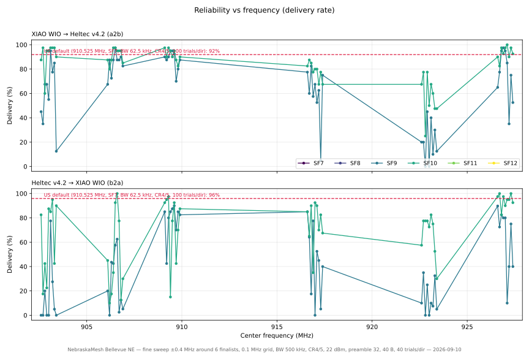
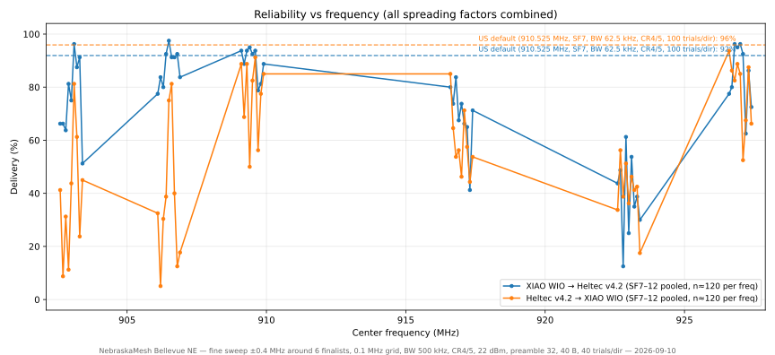
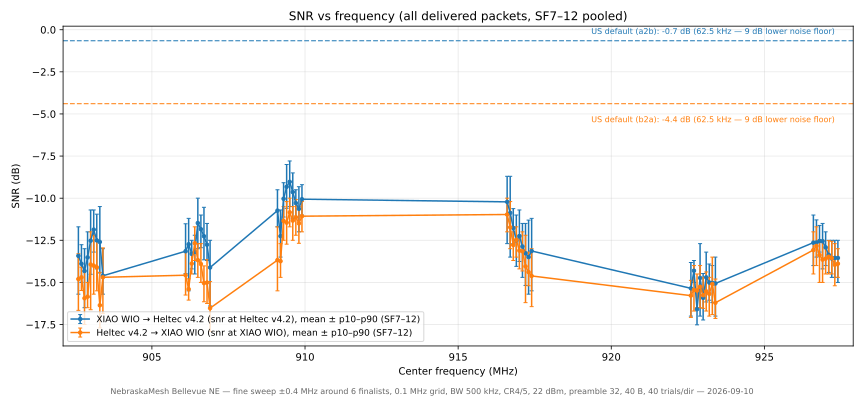
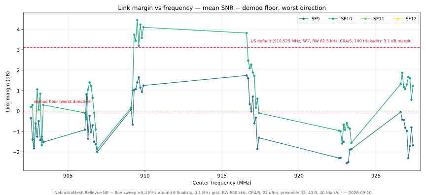
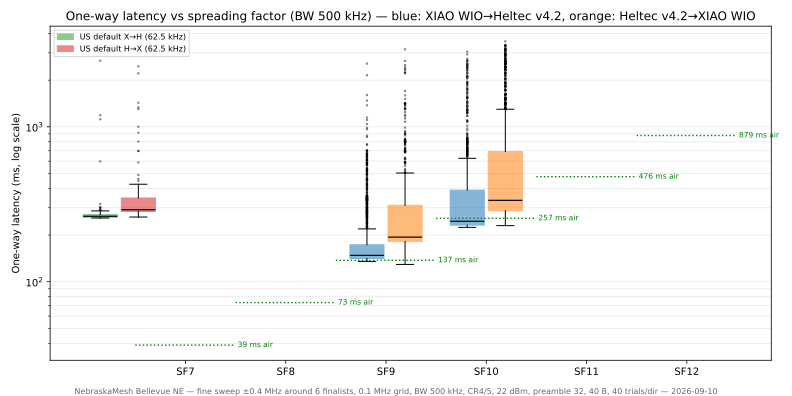

# Fine sweep ±0.4 MHz around 6 finalists — 500 kHz, SF9–10

**Mesh:** NebraskaMesh · **Date:** 2026-09-10 · **Location:** Bellevue, NE, USA
**Path:** indoor XIAO WIO ↔ gazebo Heltec v4.2, ~3.9 mi — see the [mesh README](../README.md)
**Companion campaign:** [band sweep](../2026-09-10-902-928-band-sweep/) (same day, morning/early afternoon)

## TL;DR

- **Winner: 909.6 MHz** — 90% worst-direction, 92% average across SF9–10;
  best single cell measured in any campaign. The whole 909.1–909.9 stretch
  is good (5 of the top 9 frequencies), i.e. a wide ridge, not a lucky spike.
- **Every finalist cluster's true peak moved at 0.1 MHz resolution:**
  903.0 → **903.1**, 909.5 → **909.6**, 917.0 → **916.6**, 927.0 → **926.8**.
  Only 906.5 held its own center.
- **Two finalists collapsed under re-examination:** 923.0 went 0/40+0/40 at
  SF9 (rank 53 of 54 — its Run 1 result was a lucky window) and 917.0 went
  0/40 b2a at SF9 (rank 46). The ±0.4 MHz neighborhoods saved both clusters:
  **926.8–926.9** and **916.6** are the real peaks.
- **Recommended band-spread set (n=40 evidence):** **903.1 · 906.5 · 909.6 · 926.8**
- **Best US-defaults-comparable operating point: 909.6 (or 909.1) @ SF10** —
  matches the defaults' 92–96% delivery with similar latency (p50 238–336 ms)
  and ~1.4× the throughput.

## Test setup

Identical to the [band-sweep campaign](../2026-09-10-902-928-band-sweep/)
(same nodes, antennas, path, TX power). Same-day, immediately following a
fresh US-defaults control run (see below), so both runs share one
interference-conditions window.

## Method

Run 2 of the campaign day — 54 center frequencies (the 6 Run-1 finalists
903.0 / 906.5 / 909.5 / 917.0 / 923.0 / 927.0, each swept ±0.4 MHz on a
0.1 MHz grid) × SF9–10, oneway mode, 40 trials per direction per
combination (≈160 packets/frequency), payload 40 B, CR4/5, 22 dBm,
preamble 32. Ran 16:10–18:29 CDT (≈2.3 h), 8,634 trials.

```
python orchestrate.py \
  --mode oneway --bw 500 --cr 5 --tx 22 --preamble 32 --payload-len 40 \
  --trials 40 --trial-delay 0.5 --settle 3 \
  --vary freq=902.6,...,927.4 --vary sf=9,10
```

Same-session control — US defaults (910.525 MHz, 62.5 kHz, SF7), 100
trials/direction, 16:08–16:09 CDT, immediately before the sweep:

```
python orchestrate.py \
  --mode oneway --freq 910.525 --bw 62.5 --sf 7 --cr 5 \
  --tx 22 --preamble 32 --payload-len 40 \
  --trials 100 --trial-delay 0.5 --settle 3
```

## Results

### Control: US defaults (same session)

| Direction | Delivered | One-way p50 / p90 |
|---|---:|---|
| a2b | 91/99 (92%) | ~260 / ~300 ms |
| b2a | 94/98 (96%) | ~295 / ~360 ms |

Consistent with the morning baseline (93%/97%) — the comparison below is
against a stable reference.

### Ranking — all 54 frequencies (worst-direction delivery across SF9–10, n=160/freq)

| Rank | Freq (MHz) | Worst | Avg | | Rank | Freq (MHz) | Worst | Avg |
|---:|---:|---:|---:|---|---:|---:|---:|---:|
| 1 | **909.6** | **90%** | 92% | | 28 | 903.2 | 28% | 74% |
| 2 | 909.1 | 85% | 91% | | 29 | 922.9 | 25% | 56% |
| 3 | 926.8 | 82% | 89% | | 30 | 906.1 | 20% | 55% |
| 4 | 909.9 | 82% | 87% | | 31 | 922.7 | 20% | 52% |
| 5 | 926.9 | 80% | 92% | | 32 | 902.8 | 20% | 48% |
| 6 | 909.3 | 80% | 91% | | 33 | 916.8 | 18% | 69% |
| 7 | 927.0 | 80% | 91% | | 33 | 906.3 | 18% | 55% |
| 8 | 903.1 | 78% | 89% | | 34 | 909.4 | 15% | 72% |
| 9 | 909.5 | 78% | 88% | | 34 | 906.8 | 12% | 52% |
| 10 | 916.6 | 78% | 82% | | 35 | 927.1 | 10% | 72% |
| 11 | 927.3 | 75% | 87% | | 36 | 923.1 | 10% | 50% |
| 12 | 926.7 | 72% | 83% | | 37 | 922.6 | 10% | 39% |
| 13 | 909.8 | 70% | 79% | | 37 | 923.2 | 8% | 38% |
| 14 | 926.6 | 65% | 86% | | 38 | 906.9 | 5% | 51% |
| 15 | 906.6 | 62% | 86% | | 39 | 903.3 | 5% | 57% |
| 16 | 916.7 | 60% | 69% | | 40 | 917.3 | 5% | 43% |
| 16 | 906.5 | 57% | 86% | | 41 | 923.4 | 5% | 24% |
| 18 | 917.1 | 52% | 69% | | 42 | 906.7 | 2% | 66% |
| 19 | 917.2 | 45% | 61% | | 43 | 917.0 | 0% | 60% |
| 20 | 909.2 | 42% | 79% | | 44 | 903.0 | 0% | 59% |
| 21 | 909.7 | 42% | 68% | | 45 | 902.6 | 0% | 54% |
| 22 | 927.4 | 40% | 69% | | 46 | 903.4 | 0% | 48% |
| 23 | 917.4 | 40% | 62% | | 46 | 902.9 | 0% | 46% |
| 24 | 906.4 | 35% | 66% | | 47 | 906.2 | 0% | 44% |
| 25 | 927.2 | 35% | 65% | | 48 | 902.7 | 0% | 38% |
| 26 | 916.9 | 35% | 62% | | 49 | 923.0 | 0% | 31% |
| 27 | 923.3 | 30% | 41% | | 50 | 922.8 | 0% | 26% |

*(avg = mean of the four SF9/SF10 × a2b/b2a delivery fractions)*

### Top cells in detail (a2b/b2a out of 40)

| Freq | SF9 a2b | SF9 b2a | SF10 a2b | SF10 b2a | SF9 SNR (a/b) | SF10 SNR (a/b) |
|---:|---:|---:|---:|---:|---|---|
| **909.6** | 37 | 36 | 38 | 37 | −10.4/−10.8 | −8.9/−11.8 |
| 909.1 | 36 | 34 | 39 | 37 | −10.5/−12.4 | −10.9/−14.8 |
| 926.8 | 38 | 33 | 39 | 33 | −12.2/−12.9 | −12.9/−13.8 |
| 926.9 | 39 | 32 | 37 | 39 | −12.2/−13.3 | −13.0/−13.9 |
| 909.3 | 36 | 32 | 39 | 39 | −10.3/−11.5 | −9.8/−11.3 |
| 927.0 | 38 | 32 | 39 | 36 | −12.5/−13.5 | −13.4/−13.7 |
| 903.1 | 38 | 31 | 39 | 34 | −11.8/−13.0 | −11.9/−14.9 |
| 906.5 | 39 | 23 | 39 | 37 | −11.0/−13.5 | −11.9/−13.8 |
| 917.0 | 27 | **0** | 32 | 37 | −11.8/— | −12.6/−13.1 |
| 923.0 | **0** | **0** | 20 | 29 | —/— | −15.9/−15.8 |

### Latency of the leaders (one-way, ms, p50/p90)

| Freq | SF9 a2b | SF9 b2a | SF10 a2b | SF10 b2a |
|---:|---|---|---|---|
| 909.6 | 157/470 | 194/488 | 323/623 | 323/1836 |
| 909.1 | 148/333 | 195/378 | 238/597 | 312/1164 |
| 926.8 | 146/487 | 186/250 | 232/408 | 308/2107 |
| 906.5 | 148/437 | 193/387 | 265/519 | 336/1039 |

## Plots



*Per-SF delivery across all 54 fine-sweep frequencies, with the
same-session US-defaults reference lines.*



*Both SFs pooled. The 909.x ridge and 926.8–927.0 rise above everything
else; the 923.0 canyon is unmistakable.*







## Findings

1. **0.1 MHz resolution matters.** All four surviving clusters peaked
   0.1–0.4 MHz away from their Run-1 grid point. Channels are lumpy at
   100 kHz scale — a 0.5 MHz grid finds neighborhoods, not channels.
2. **Fine-sweep n=40 demotes two of six Run-1 finalists.** 923.0's
   morning result (75% worst) did not reproduce: 0/40+0/40 at SF9. 917.0
   went 0/40 b2a at SF9. Small-n windows on a busy channel can flatter a
   frequency; the confirmation run exists to catch exactly this.
3. **The 909.x ridge is wide and stable.** 909.1–909.9 puts five cells in
   the top nine; individual mid-ridge dips (909.2, 909.4, 909.7 at 42%
   worst) look like transient interference during their test windows
   rather than channel properties — their immediate neighbors are all
   ≥70%.
4. **The 923.0 dead zone is wider than Run 1 showed.** The entire
   922.6–923.4 neighborhood averaged ≤56%, with 922.8/923.0 at 26–31%.
   Combined with Run 1's 922.0 (0% everywhere), 922–923.4 is the worst
   stretch of the band on this path.
5. **Direction asymmetry persists at every frequency** — b2a (into the
   indoor node) is worse in 48 of 54 cells; mean penalty ~1.5–2.5 dB.
6. **What to run:** **903.1 · 906.5 · 909.6 · 926.8** (band-spread
   quartet, all ≥57% worst / ≥86% avg), with **909.6 @ SF10** as the
   single-frequency choice most comparable to US defaults (equal
   delivery, similar latency, 1.4× throughput). Confirmation runs
   (n=100 + burst) are the next step before committing.

## Data

| File | Contents |
|---|---|
| `data/fine-sweep-raw.jsonl.gz` | 8,634 one-way trials (54 freqs × SF9–10 × 2 dirs × 40) |
| `data/us-defaults-control-raw.jsonl.gz` | 197 control trials, same session |
| `data/summary.csv` | Per-combination delivery counts (fine sweep) |
