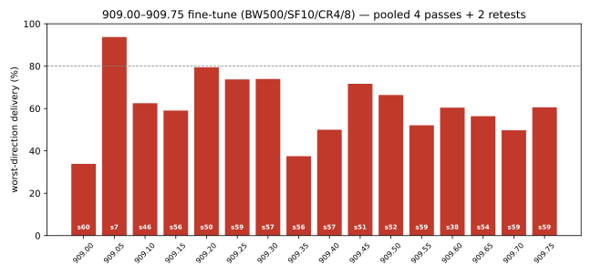

# 909.00–909.75 MHz band fine-tune — burst susceptibility at 500 kHz, SF10, CR4/8

**Mesh:** NebraskaMesh · **Date:** 2026-09-11 (13:25–16:32 CDT) · **Location:** Bellevue, NE, USA
**Path:** indoor XIAO WIO ↔ gazebo Heltec v4.2, ~3.9 mi — see the [mesh README](../README.md)
**Companion campaigns:** [916/926 fine-tune](../2026-09-11-916-926-band-finetune/) (same evening) · [burst-resilience](../2026-09-11-9091-9096-burst-resilience/) (same day, morning)

## TL;DR

- **Question:** within the 909.x LoRaWAN-adjacent region, is there a center
  frequency that dodges the minute-scale burst interference that dominates b2a
  on this path? **Answer: no.** Every one of the 16 cells, 50 kHz apart, took
  burst hits across 4 interleaved passes + 2 retest rounds.
- **Best 909 cell: 909.05 MHz** — 93.8% worst-direction (n=240/dir), b2a max
  streak 7, only 54% of its losses in streaks. It is the **anchor for the 909
  range**, not a deployment candidate.
- **Runner-up 909.20** (79.4% worst, n=360/dir incl. retests); worst cells
  909.00 (33.9%) and 909.35 (37.5%).
- **a2b (gazebo RX) was uniformly excellent** (89.6–95.8%, max streak 2) at
  every frequency through the same windows that shredded b2a. Every ranking
  here is a b2a story.
- Burst windows fired in **all six phases** (every pass and both retests):
  the interference is persistent, not a one-hour event.
- Methodological note: an aggregation bug in the driver's in-memory stats
  (phase-overwrite) limited real-time flagging to pass-4 data; the retest set
  was therefore chosen from an incomplete view. All numbers in this report are
  rebuilt from the raw per-trial logs (see RUN-MANIFEST), which are complete.

## Test setup

Same nodes/path/power as the morning campaigns. Indoor node (aries, API at
aries.huebert.org) and gazebo node (lynx, lynx.huebert.org), ~3.9 mi
line-of-sight. Unattended driver: 4 interleaved passes over the 16-cell grid
(909.00–909.75 @ 0.05), order rotated + alternately reversed per pass so each
cell samples different clock times, then automated burst retests of flagged
cells + 2 cleanest controls. 12:56–16:32 CDT, unattended.

## Method

`oneway` mode (unidirectional pings, passive reception), 40 B payload,
22 dBm, preamble 32:

- **Constant:** BW 500 kHz, SF10, CR4/8 (312 ms airtime, 1026 bit/s)
- **Swept:** frequency 909.00–909.75 @ 0.05 MHz (16 cells)
- **Trials:** 60 per direction per cell per pass; 4 passes + 2 retest rounds
  (retests: 8 flagged cells + 2 controls, 60/dir each) — 240–360 trials/dir
  per cell, ≈10,100 trials total
- Runtime: ~3 h 5 min
- Burst detection: loss streak ≥3, direction-specific noise-floor flags
  (aries ≥ −95 dBm, lynx ≥ −85 dBm), per-phase cutoff checks vs pooled rate

```
rf-sweep-core-kit/.venv/bin/python finetune_909.py   # 4 passes, auto-retests, ranked report
```

## Results

### Delivery ladder (pooled over all phases run per cell)

| freq | a2b | b2a | worst | a2b max streak | b2a max streak | b2a losses in streaks | mean SNR a2b/b2a | flags |
|---|---|---|---|---|---|---|---|---|
| **909.05** | 225/240 (93.8%) | 227/240 (94.6%) | **93.8%** | 2 | 7 | 54% | −11.4/−13.4 | streak7@pass1/b2a |
| 909.20 | 344/360 (95.6%) | 286/360 (79.4%) | 79.4% | 1 | 50 | 95% | −10.9/−12.9 | streak50, cutoff, streak20 |
| 909.30 | 222/240 (92.5%) | 176/238 (74.0%) | 74.0% | 1 | 57 | 92% | −10.9/−12.0 | streak57, cutoff |
| 909.25 | 229/240 (95.4%) | 177/240 (73.8%) | 73.8% | 1 | 59 | 94% | −10.6/−12.7 | streak59, cutoff |
| 909.45 | 326/360 (90.6%) | 258/360 (71.7%) | 71.7% | 2 | 51 | 89% | −10.9/−12.6 | streaks 51+38, cutoffs |
| 909.50 | 322/360 (89.4%) | 239/360 (66.4%) | 66.4% | 2 | 52 | 96% | −10.9/−12.8 | streaks 38+24+52 |
| 909.10 | 223/240 (92.9%) | 150/240 (62.5%) | 62.5% | 2 | 46 | 97% | −11.2/−12.6 | streaks 11+46+28 |
| 909.75 | 332/360 (92.2%) | 218/360 (60.6%) | 60.6% | 2 | 59 | 92% | −10.4/−12.2 | streaks 58+14+59 |
| 909.60 | 222/240 (92.5%) | 145/240 (60.4%) | 60.4% | 2 | 38 | 94% | −11.1/−12.6 | streaks 23+28+38 |
| 909.15 | 339/360 (94.2%) | 212/359 (59.1%) | 59.1% | 2 | 56 | 97% | −11.0/−13.1 | streaks 27+56+15+45 |
| 909.65 | 322/360 (89.4%) | 203/360 (56.4%) | 56.4% | 2 | 54 | 97% | −10.6/−12.6 | streaks 54+53+45 |
| 909.55 | 215/240 (89.6%) | 125/240 (52.1%) | 52.1% | 2 | 59 | 89% | −11.5/−12.8 | streaks 43+59 |
| 909.40 | 221/240 (92.1%) | 120/240 (50.0%) | 50.0% | 1 | 57 | 93% | −10.9/−12.2 | streaks 45+10+57 |
| 909.70 | 326/360 (90.6%) | 179/360 (49.7%) | 49.7% | 2 | 59 | 94% | −10.6/−12.5 | streaks 12+33+56+59+10 |
| 909.35 | 219/240 (91.2%) | 90/240 (37.5%) | 37.5% | 2 | 56 | 99% | −11.2/−12.3 | streaks 45+56+48 |
| 909.00 | 345/360 (95.8%) | 122/360 (33.9%) | 33.9% | 2 | 60 | 99% | −11.1/−13.2 | streaks 27+53+37+58+60 |



### b2a by phase (windows roam the band)

| freq | pass1 | pass2 | pass3 | pass4 | retest1 | retest2 |
|---|---:|---:|---:|---:|---:|---:|
| 909.00 | 53! (27) | 12! (53) | 98 (1) | 37! (37) | 3! (58) | 0! (60) |
| 909.05 | 85 (7) | 95 (1) | 100 (0) | 98 (1) | – | – |
| 909.10 | 82 (11) | 22! (46) | 52! (28) | 95 (2) | – | – |
| 909.15 | 52! (27) | 7! (56) | 98 (1) | 75! (15) | 98 (1) | 25! (45) |
| 909.20 | 17! (50) | 97 (1) | 67! (20) | 98 (1) | 100 (0) | 98 (1) |
| 909.25 | 2! (59) | 97 (1) | 98 (1) | 98 (1) | – | – |
| 909.30 | 3! (57) | 95 (1) | 100 (0) | 97 (1) | – | – |
| 909.35 | 23! (45) | 7! (56) | 20! (48) | 100 (0) | – | – |
| 909.40 | 23! (45) | 78! (10) | 5! (57) | 93 (1) | – | – |
| 909.45 | 92 (2) | 15! (51) | 93 (1) | 37! (38) | 95 (1) | 98 (1) |
| 909.50 | 35! (38) | 90 (2) | 100 (0) | 100 (0) | 60! (24) | 13! (52) |
| 909.55 | 28! (43) | 87 (1) | 2! (59) | 92 (1) | – | – |
| 909.60 | 62! (23) | 52! (28) | 35! (38) | 93 (1) | – | – |
| 909.65 | 100 (0) | 95 (1) | 97 (1) | 10! (54) | 12! (53) | 25! (45) |
| 909.70 | 72! (12) | 95 (1) | 43! (33) | 7! (56) | 2! (59) | 80 (10) |
| 909.75 | 93 (1) | 3! (58) | 95 (1) | 73! (14) | 2! (59) | 97 (1) |

b2a delivery % per phase, (max streak) in parens, ! = below 80%, – = phase not
run (retests only covered the 8 flagged cells + 2 controls). Note 909.00's
retest2: **0/60 b2a — an entire phase erased** — while its a2b ran 95.8% pooled.

## Findings

1. **Frequency choice inside 909.x cannot dodge the bursts.** 16 cells spaced
   50 kHz apart, burst events in every phase, streak-loss fractions 89–99%
   everywhere except 909.05. The interference is wideband across this region.
2. **909.05 is the 909-range anchor** (93.8% worst, streak 7, 54% of losses in
   streaks). 909.20 is second (79.4% over 6 phases). If 909.x-class spectrum
   is ever used, 909.05 is the pick — but its b2a still bled 13 losses, more
   than half of them in streaks. "Best on 909" ≠ "burst-free."
3. **The burst noise is local to the indoor node's receive side** (b2a =
   lynx→aries with aries indoor RX). a2b stayed 89.6–95.8% at every frequency,
   every phase. Indoor-node mitigation (antenna move, filtering) would matter
   more than any frequency choice within the region.
4. **Delivered-packet SNR stayed healthy** (−10 to −13 dB) through the wiped
   phases — additive burst noise, not path loss.
5. **The retest controls were not clean** (909.50: streaks in pass1, retest1,
   *and* retest2) — proof that single-pass flagging underestimates the burst
   environment, and that multi-pass interleaved pooling (this campaign's
   design) is the right methodology for burst characterization.
6. **National implication:** 909.x sits inside the LoRaWAN US915 FSB5 125 kHz
   ladder and (at 500 kHz) overlaps its 500 kHz channels; combined with
   ridge-wide burst susceptibility it is not a viable national channel.

## Data

| File | Contents |
|---|---|
| `data/pass{1..4}-raw.jsonl.gz` | 4 interleaved passes × 1,920 trials (16 freqs × 2 dirs × 60) |
| `data/retest{1..2}-raw.jsonl.gz` | 2 retest rounds × 1,200 trials (10 cells × 2 dirs × 60) |
| `data/<phase>-summary.csv` | Per-combination delivery counts |
