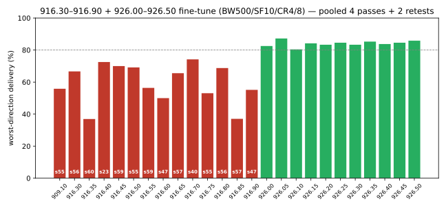
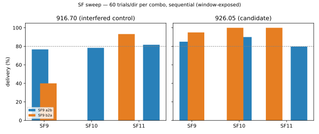

# 916.30–916.90 + 926.00–926.50 MHz fine-tune — and the SF sweep — the 926 verdict

**Mesh:** NebraskaMesh · **Date:** 2026-09-11 (16:43–21:51 CDT) · **Location:** Bellevue, NE, USA
**Path:** indoor XIAO WIO ↔ gazebo Heltec v4.2, ~3.9 mi — see the [mesh README](../README.md)
**Companion campaigns:** [909 fine-tune](../2026-09-11-909-band-finetune/) (same afternoon) · [burst-resilience](../2026-09-11-9091-9096-burst-resilience/) (same day, morning)

## TL;DR

- **Question:** do the two structurally empty windows of 902–928 — 916.3–916.9
  (above the LoRaWAN ladder, below NextNav) and 926.0–926.5 (inside NextNav's
  license, measured silent locally) — escape the burst interference that owns
  909.x? **Answer: 916.x does not; 926.0–926.5 does, completely.**
- **Winner: 926.05 MHz @ SF10/CR4/8** — 87.2% worst-direction (n=360/dir),
  b2a 96.7%, **max streaks 2/2, zero burst flags across 6 phases**. Best
  single session: 90% a2b / 100% b2a (SF sweep), zero burst losses.
- **The bursts follow the spectrum, not the site.** All 13 916.x cells
  collapsed (b2a 36.9–74.2%, streaks to 60, 71–95% of losses in streaks) in
  the same hours the 926 ridge stayed clean — with the 909.10 control
  replicating its 909-campaign baseline in between.
- **SF sweep addendum (926.05 × SF9/10/11):** SF10 is the best operating point
  (90% a2b / 100% b2a, zero burst losses). **SF11 gave no a2b gain** (79.7%
  vs 90%) — 926's a2b losses are not SNR-fixable, so SF11 buys nothing here
  but costs 2× airtime. **SF9 (85%/95%) is a viable efficiency option** at
  half the airtime.
- **Deployment decision (for the record):** SF10 or SF11. SF9/SF11 sweeps
  exist to characterize the channel: SF11's lack of a2b improvement and
  916.70's SF-independent wipe (0/60 at SF10, 93% at SF11, minutes apart)
  confirm bursts are not a processing-gain problem.

## Test setup

Same nodes/path/power as the afternoon 909 campaign. Unattended driver:
4 interleaved passes over 25 combinations (13× 916.30–916.90 @ 0.05,
11× 926.00–926.50 @ 0.05, 909.10 control), order rotated + alternately
reversed per pass; automated burst retests of flagged cells + 2 controls
(926.05, 926.35); then a 6-combo SF sweep on the campaign winners.

## Method

`oneway` mode (unidirectional pings, passive reception), 40 B payload,
22 dBm, preamble 32:

- **Constant:** BW 500 kHz, CR4/8, SF10 for the main campaign
- **Swept:** frequency 916.30–916.90 @ 0.05 + 926.00–926.50 @ 0.05 + 909.10
  control; then SF {9, 10, 11} × {916.70, 926.05}
- **Trials:** 60/dir per cell per pass × 4 passes + 2 retest rounds → 240–360
  trials/dir per cell (main campaign ≈ 14,300 trials); SF sweep 60/dir per
  combo (720 trials)
- Runtime: main ~4 h 50 min; SF sweep ~17 min
- Regulatory note: every cell in the 926 grid keeps the −20 dBc edge of a
  500 kHz BW500/22 dBm signal below 927.0 MHz (926.05 worst-case edge ≈
  926.41 incl. ±27 kHz drift) — clear of the 33 cm ham repeater output
  segment by construction

```
rf-sweep-core-kit/.venv/bin/python finetune_sweep.py \
  --grid 916.30:916.90:0.05 --grid 926.00:926.50:0.05 --freqs 909.10 \
  --out finetune916-926
rf-sweep-core-kit/.venv/bin/python orchestrate.py \
  --vary freq=916.7,926.05 --vary sf=9,10,11 --cr 8 --bw 500 \
  --trials 60 --trial-delay 0.5
```

## Results

### Delivery ladder — 926 ridge (burst-free, all cells)

| freq | a2b | b2a | worst | a2b max streak | b2a max streak | mean SNR a2b/b2a |
|---|---|---|---|---|---|---|
| **926.05** | 314/360 (87.2%) | 347/359 (96.7%) | **87.2%** | 2 | 2 | −11.1/−11.9 |
| 926.50 | 206/240 (85.8%) | 234/240 (97.5%) | 85.8% | 1 | 1 | −11.6/−11.7 |
| 926.35 | 307/360 (85.3%) | 347/359 (96.7%) | 85.3% | 2 | 2 | −11.2/−11.9 |
| 926.25 | 203/240 (84.6%) | 230/240 (95.8%) | 84.6% | 2 | 1 | −12.1/−12.1 |
| 926.45 | 203/240 (84.6%) | 233/240 (97.1%) | 84.6% | 2 | 1 | −11.0/−12.3 |
| 926.15 | 202/240 (84.2%) | 227/239 (95.0%) | 84.2% | 1 | 2 | −11.7/−12.4 |
| 926.40 | 201/240 (83.8%) | 231/240 (96.2%) | 83.8% | 1 | 1 | −11.9/−11.9 |
| 926.20 | 200/240 (83.3%) | 229/240 (95.4%) | 83.3% | 4 | 2 | −11.8/−12.4 |
| 926.30 | 200/240 (83.3%) | 236/240 (98.3%) | 83.3% | 2 | 1 | −11.5/−12.0 |
| 926.00 | 198/240 (82.5%) | 233/239 (97.5%) | 82.5% | 2 | 2 | −11.7/−12.2 |
| 926.10 | 193/240 (80.4%) | 232/240 (96.7%) | 80.4% | 3 | 1 | −11.3/−12.2 |

### Delivery ladder — 916 ridge (burst-dominated, like 909) + control

| freq | a2b | b2a | worst | a2b max streak | b2a max streak | b2a losses in streaks | flags |
|---|---|---|---|---|---|---|---|
| 916.70 | 205/240 (85.4%) | 178/240 (74.2%) | 74.2% | 4 | 40 | 71% | streaks 40+4 |
| 916.40 | 204/240 (85.0%) | 174/240 (72.5%) | 72.5% | 2 | 23 | 80% | streaks 23+16+12 |
| 916.45 | 192/240 (80.0%) | 168/240 (70.0%) | 70.0% | 3 | 59 | 82% | streak 59, cutoff 2% |
| 916.50 | 201/240 (83.8%) | 166/240 (69.2%) | 69.2% | 2 | 55 | 86% | streaks 55+3, cutoff |
| 916.80 | 183/240 (76.2%) | 165/240 (68.8%) | 68.8% | 5 | 56 | 84% | streaks 56+3 |
| 916.30 | 199/240 (82.9%) | 160/240 (66.7%) | 66.7% | 3 | 56 | 90% | streaks 56+16, cutoff |
| 916.65 | 298/360 (82.8%) | 236/360 (65.6%) | 65.6% | 3 | 57 | 79% | streaks 57+10+26 |
| 916.55 | 307/360 (85.3%) | 203/360 (56.4%) | 56.4% | 3 | 59 | 89% | streaks 58+59 |
| 909.10 (control) | 343/359 (95.5%) | 201/360 (55.8%) | 55.8% | 2 | 55 | 94% | streaks 5+28+55+48 |
| 916.90 | 292/360 (81.1%) | 198/359 (55.1%) | 55.1% | 3 | 47 | 84% | streaks 47+46 |
| 916.75 | 282/360 (78.3%) | 191/360 (53.1%) | 53.1% | 4 | 55 | 90% | streaks 39+55 |
| 916.60 | 298/360 (82.8%) | 180/360 (50.0%) | 50.0% | 3 | 47 | 95% | streaks 26+33+21 |
| 916.85 | 298/360 (82.8%) | 133/359 (37.0%) | 37.0% | 6 | 57 | 91% | streaks 49+57 |
| 916.35 | 294/360 (81.7%) | 133/360 (36.9%) | 36.9% | 3 | 60 | 95% | streaks 53+47 |



### b2a by phase — the two ridges side by side

| freq | pass1 | pass2 | pass3 | pass4 | retest1 | retest2 |
|---|---:|---:|---:|---:|---:|---:|
| 909.10 | 85 (5) | 52! (28) | 8! (55) | 20! (48) | 77! (13) | 93 (1) |
| 916.30 | 93 (1) | 7! (56) | 70! (16) | 97 (1) | – | – |
| 916.35 | 85 (2) | 10! (53) | 95 (1) | 22! (47) | 10! (53) | 0! (60) |
| 916.40 | 57! (23) | 93 (1) | 65! (16) | 75! (12) | – | – |
| 916.45 | 95 (1) | 2! (59) | 93 (1) | 90 (1) | – | – |
| 916.50 | 93 (1) | 8! (55) | 82 (3) | 93 (2) | – | – |
| 916.55 | 85 (2) | 3! (58) | 92 (1) | 2! (59) | 70! (15) | 87 (6) |
| 916.60 | 48! (26) | 95 (1) | 43! (33) | 60! (21) | 22! (47) | 32! (40) |
| 916.65 | 90 (2) | 5! (57) | 68! (10) | 50! (26) | 85 (1) | 95 (1) |
| 916.70 | 88 (2) | 85 (1) | 32! (40) | 92 (2) | – | – |
| 916.75 | 30! (39) | 87 (2) | 8! (55) | 75! (4) | 65! (15) | 53! (28) |
| 916.80 | 5! (56) | 97 (1) | 92 (2) | 82 (3) | – | – |
| 916.85 | 12! (49) | 81 (1) | 90 (2) | 5! (57) | 7! (55) | 28! (40) |
| 916.90 | 7! (47) | 85 (2) | 87 (1) | 22! (46) | 95 (1) | 37! (31) |
| 926.00 | 97 (2) | 97 (1) | 97 (1) | 100 (0) | – | – |
| **926.05** | 92 (1) | 97 (1) | 98 (1) | 98 (1) | 98 (1) | 97 (2) |
| 926.10 | 93 (1) | 98 (1) | 95 (1) | 100 (0) | – | – |
| 926.15 | 95 (1) | 93 (2) | 97 (1) | 95 (1) | – | – |
| 926.20 | 92 (2) | 93 (2) | 97 (1) | 100 (0) | – | – |
| 926.25 | 90 (1) | 93 (1) | 100 (0) | 100 (0) | – | – |
| 926.30 | 98 (1) | 97 (1) | 98 (1) | 100 (0) | – | – |
| 926.35 | 100 (0) | 93 (1) | 93 (1) | 98 (1) | 95 (2) | 100 (0) |
| 926.40 | 93 (1) | 98 (1) | 97 (1) | 97 (1) | – | – |
| 926.45 | 97 (1) | 97 (1) | 100 (0) | 95 (1) | – | – |
| 926.50 | 97 (1) | 97 (1) | 98 (1) | 98 (1) | – | – |

b2a delivery % per phase, (max streak) in parens, ! = below 80%, – = phase not
run. The 916 retests ran hours after pass 1 and *still* burst — the lower-band
interference is persistent. The 926 rows never dipped below 90%.

### SF sweep — 926.05 vs 916.70 (60 trials/dir per combo, sequential)

| cell | SF | a2b | b2a | max streaks | burst-loss | noise a/b (dBm) |
|---|---:|---|---|---|---|---|
| 916.70 | 9 | 76.7% | 40.0% | 2 / 33 | 92% | −101.0/−94.2 |
| 916.70 | 10 | 78.3% | **0.0%** | 3 / 60 | 100% | −100.8/−89.5 |
| 916.70 | 11 | 81.7% | 93.2% | 3 / 3 | 75% | −102.0/−94.9 |
| 926.05 | 9 | 85.0% | 95.0% | 2 / 1 | 0% | −101.2/−94.8 |
| **926.05** | **10** | **90.0%** | **100%** | 1 / 0 | **0%** | −103.5/−95.0 |
| 926.05 | 11 | 79.7% | 100% | 2 / 0 | 17% | −103.2/−95.2 |



## Findings

1. **The bursts follow the spectrum, not the site.** The 916 ridge collapsed
   exactly like 909 while the 926 ridge — 10 MHz away, same sites, same hours,
   same hardware — never lost a packet to a burst. The interferer(s) live in
   the occupied 902–917 region (hopping/intermittent emitters), not at the
   lynx or aries site per se.
2. **926.0–926.5 is the only burst-free real estate found in 902–928.** All 11
   cells: b2a 95.0–98.3%, max streaks ≤2, losses essentially random. 926.05
   leads (87.2% worst over 6 phases) with 926.35/926.50 statistically tied.
3. **SF11 does not buy back the a2b losses.** 926.05's a2b (80–90%, random
   spread, healthy delivered SNR −11 to −12) did not improve at SF11 — the
   losses are fast fading/multipath that processing gain doesn't touch. Since
   SF11 costs 2× airtime, SF10 is the operating point. (Deployment decision
   for the record: SF10 or SF11; SF9 was characterized for channel detail.)
4. **SF9 is a legitimate efficiency option:** 85%/95% with max streaks 2/1 at
   168 ms airtime (half of SF10). Single-phase sample (n=60/dir) carries ±5%
   uncertainty; worth a confirmation run if channel utilization matters.
5. **The SF sweep's negative control nailed the mechanism:** 916.70 wiped at
   SF10 (0/60 b2a) yet clean at SF11 (93%) minutes apart — a burst window
   rolling through, indifferent to spreading factor. Higher SF cannot buy
   burst immunity in the 902–917 region.
6. **926 a2b/b2a inversion:** on 926, b2a (96–98%) outperforms a2b (80–87%) —
   opposite of the 909/916 ridges where a2b was the strong direction. The a2b
   cost at 926 is small, random, and uncorrelated with bursts; watch it in
   longer campaigns, but it does not change the ranking.
7. **Regulatory posture:** the 926 grid sits inside NextNav's 920–928 MHz
   license area (currently silent/quiet locally). 926.05 keeps the −20 dBc
   edge ≈ 600 kHz below 927.0 even with worst-case drift. Full band-exhaustion
   argument and ham-clearance math: `NATIONAL-FREQ-STRATEGY.md` in the
   rf-sweep-core-kit.

## Data

| File | Contents |
|---|---|
| `data/pass{1..4}-raw.jsonl.gz` | 4 interleaved passes × 3,000 trials (25 combos × 2 dirs × 60) |
| `data/retest{1..2}-raw.jsonl.gz` | 2 retest rounds × 1,200 trials (10 cells × 2 dirs × 60) |
| `data/sf-sweep-raw.jsonl.gz` | SF9/10/11 × {916.70, 926.05}, 60 trials/dir per combo |
| `data/<phase>-summary.csv` | Per-combination delivery counts |
