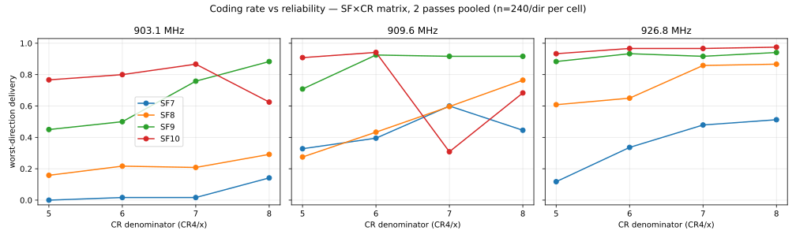
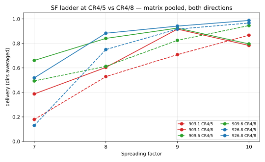
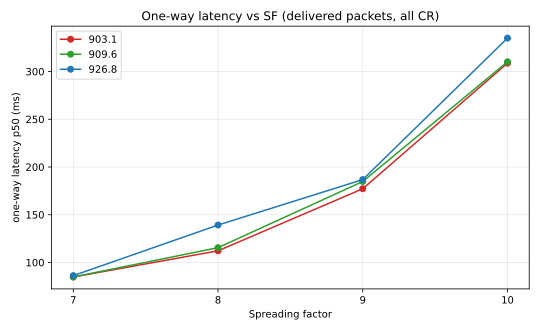
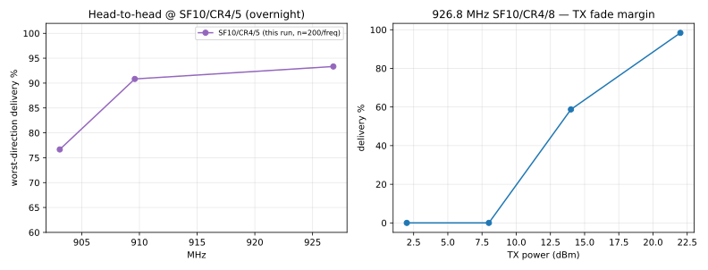

# SF×CR optimization + finalist confirmation on the fine-sweep trio (903.1 / 909.6 / 926.8)

**Mesh:** NebraskaMesh · **Date:** 2026-09-10/11 (overnight) · **Location:** Bellevue, NE, USA
**Path:** indoor XIAO WIO ↔ gazebo Heltec v4.2, ~3.9 mi — see the [mesh README](../README.md)
**Companion campaigns:** [band sweep](../2026-09-10-902-928-band-sweep/), [fine sweep](../2026-09-10-fine-sweep/) (same day, earlier)

## TL;DR

- **Winner confirmed: 926.8 MHz** — 100% worst-direction delivery at SF10 at
  *every* coding rate in *both* matrix passes, 98% worst-direction in the n=150
  deep pass, zero fade holes. The only frequency of the trio that is strong in
  both directions at every SF.
- **Optimal coding rate: CR4/8 for max robustness, CR4/6 for best value.**
  CR4/8 rescues SF8 outright (+25 pp on 926.8, +48 pp on 909.6 b2a) and is
  best-or-tied at every SF; CR4/6 is statistically tied at SF10 (96.7% vs
  97.5% worst-dir) for +7% airtime instead of +22%. CR4/7 fills no niche;
  CR4/5 measurably hurts at SF8–9.
- **SF7 cannot be rescued by any CR.** The SF ladder cliff on this path sits
  between SF8 and SF7; FEC coding gain cannot buy back the missing link budget.
- **Recommended operating point: 926.8 MHz, SF10, CR4/8** (or CR4/6 to save
  airtime). **926.8 @ SF9/CR4/8** (94%/97% both dirs, 168 ms airtime) is the
  fast option; **SF8 only with CR4/8; SF7: don't.**
- **909.6 demoted:** best raw SNR of the trio (−9.0 a2b) but bursty b2a
  interference windows dropped cells to 0/60 and 8/60 in matrix pass 2 that
  scored fine in pass 1 — same failure mode the fine sweep saw at 909.5.
  Daytime retest before ruling it out.
- **903.1 direction pathology:** a2b is excellent at every SF ≥ 8, but b2a at
  SF7–8 is dead *in both passes* (0–31/60) — a real channel property, not a
  transient. Worst SNR asymmetry (3.4 dB against the indoor node).
- **Fade margin at the winner: ~12–14 dB.** 8 dBm TX = link dead (0/80),
  14 dBm = cliff start (12/40 a2b). Payload (20–100 B) and preamble (8–32)
  are all fully reliable — preamble 8 works and saves ~49 ms/packet.

## Test setup

Identical to the [fine-sweep campaign](../2026-09-10-fine-sweep/) (same nodes,
antennas, path, TX power). Ran overnight 23:03–03:16 CDT (04:03–08:16 UTC),
fully unattended via a campaign driver (`overnight.py` in the kit) that
executes every phase sequentially and picks the deep-pass finalists
automatically from the matrix scores. Noise floors were stable all night
(node A ≈ −101 dBm, node B ≈ −94 dBm, all three freqs, start and end scans),
so all rankings below are same-conditions comparisons.

## Method

Five stage groups, all `oneway` mode, payload 40 B, 22 dBm, preamble 32,
BW 500 kHz unless noted:

1. **Head-to-head** — the three fine-sweep frequencies at SF10/CR4/5,
   100 trials/direction (n=200/freq).
2. **Fade-hole bursts** — same three frequencies, 50 trials/direction at 0.5 s
   spacing (minimum legal spacing ≈ back-to-back).
3. **SF×CR matrix** — per frequency, SF7–10 × CR4/5–4/8 (16 combos), 60
   trials/direction. Two full passes separated by a 40-minute dwell to average
   over time-varying interference. 11,505 trials total.
4. **Finalist deep passes** — top-3 (freq, SF, CR) cells by worst-direction
   delivery pooled across passes (SNR tiebreak): **926.8/SF10/CR4/8**,
   **926.8/SF10/CR4/6**, **926.8/SF9/CR4/8**. 150 trials/direction + a 60-trial
   burst each.
5. **Robustness sweeps at the winner** — TX power 2/8/14/22 dBm, payload
   20/40/100 B, preamble 8/16/32, 40 trials/direction each.

**14,465 trials** total. Representative command shape:

```
python orchestrate.py --mode oneway --bw 500 --tx 22 --preamble 32 \
  --payload-len 40 --trials 60 --trial-delay 0.5 --settle 3 \
  --freq 926.8 --vary sf=7,8,9,10 --vary cr=5,6,7,8
```

## Results

### Head-to-head at SF10/CR4/5 (n=100/direction)

| Freq (MHz) | a2b | b2a | SNR a2b / b2a (dB) | One-way p50 / p90 a2b | p50 / p90 b2a |
|---:|---:|---:|---|---|---|
| **926.8** | **99/100** | **98/100** | −10.3 / −11.3 | 254 / 464 ms | 486 / 1722 ms |
| 903.1 | 97/100 | 95/100 | −11.2 / −14.6 | 239 / 446 ms | 388 / 1432 ms |
| 909.6 | 93/100 | 99/100 | −9.0 / −11.6 | 238 / 424 ms | 382 / 1681 ms |

### Bursts (50/direction, 0.5 s spacing)

| Freq | a2b | b2a | Worst loss streak |
|---|---:|---:|---:|
| 903.1 | 49/50 | 48/50 | 1 |
| 909.6 | 46/50 | 48/50 | 1 |
| 926.8 | 46/50 | **50/50** | 1 (0) |

No multi-packet fade holes anywhere — losses on this path are isolated
single-packet events. What kills 909.6/903.1 is *minute-scale* interference
windows, which only the two-pass matrix exposed.

### SF×CR matrix (two passes pooled, n=240/direction per cell)

Worst-direction delivery by cell — top of the table:

| Freq | SF | CR | worst | avg | | Freq | SF | CR | worst | avg |
|---:|---:|---:|---:|---:|---|---:|---:|---:|---:|---:|
| **926.8** | 10 | 8 | **97.5%** | 98.8% | | 909.6 | 9 | 6 | 92.5% | 94.6% |
| 926.8 | 10 | 6 | 96.7% | 98.3% | | 909.6 | 9 | 8 | 91.7% | 92.5% |
| 926.8 | 10 | 7 | 96.7% | 98.3% | | 909.6 | 9 | 7 | 91.7% | 91.7% |
| 909.6 | 10 | 6 | 94.2% | 94.6% | | 926.8 | 9 | 7 | 91.7% | 94.6% |
| 926.8 | 9 | 8 | 94.1% | 94.1% | | 926.8 | 10 | 5 | 93.3% | 96.7% |

Bottom of the table is a uniform story: everything at SF7 (worst 0–51%) and
the 903.1 low-SF b2a cells (SF7 0–2%, SF8 16–31%).

**SF ladder, all freqs + CRs pooled (a2b / b2a):**
SF10 95% / 83% · SF9 94% / 82% · SF8 90% / 49% · SF7 59% / 28%.

**The CR effect by SF (926.8, worst-direction; the one freq where CR effects
aren't confounded by interference):**

| SF | CR4/5 | CR4/6 | CR4/7 | CR4/8 | Airtime @40 B (CR5 → CR8) |
|---:|---:|---:|---:|---:|---|
| 10 | 93.3% | 96.7% | 96.7% | **97.5%** | 257 → 312 ms (+22%) |
| 9 | 88.3% | 93.3% | 91.7% | 94.1% | 137 → 168 ms (+22%) |
| 8 | 60.8% | 65.0% | 85.8% | **86.7%** | 73 → 90 ms (+23%) |
| 7 | 11.8% | 33.6% | 47.9% | 51.3% | 39 → 48 ms (+24%) |

Same gradient at 909.6 SF8 b2a: CR4/5 33/120 → CR4/8 **91/119**. At 903.1 the
gradient exists only a2b (SF7 a2b: 11/60 at CR4/5 → 51/60 at CR4/8); its b2a
stays dead at every CR — below the demod floor no amount of FEC helps.

### Finalist deep passes (n=150/direction + 60-trial burst)

| Config | a2b | b2a | Burst a2b / b2a | One-way p50 / p90 a2b | b2a |
|---|---:|---:|---:|---|---|
| **926.8 SF10 CR4/8** | **147/150** | **150/150** | 46/60 · 60/60 | 300 / 702 ms | 473 / 1516 ms |
| 926.8 SF10 CR4/6 | 145/150 | 149/150 | 58/60 · 58/60 | 267 / 639 ms | 466 / 1517 ms |
| 926.8 SF9 CR4/8 | 141/150 | 146/150 | 55/60 · 56/60 | 184 / 548 ms | 193 / 583 ms |

(Deep-pass bursts include the SF10/CR4/8 a2b run's 46/60 — an isolated-loss
pattern with worst streak 1, consistent with the matrix.)

### Robustness at the winner (926.8 SF10 CR4/8, n=40/direction)

- **TX fade margin:** 22 dBm → 95–100%; **14 dBm → 12/40 a2b, 35/40 b2a**
  (cliff starts); **8 dBm → 0/80; 2 dBm → 0/80**. ~**12–14 dB of margin** at
  this path; this link will not tolerate much additional path loss or antenna
  degradation.
- **Payload:** 20 B → 39/40+39/40 · 40 B → 39/40+40/40 · **100 B → 39/40+40/40**.
  No payload sensitivity at this margin.
- **Preamble:** 8 → 39/40+40/40 · 16 → 39/40+39/40 · 32 → 40/40+40/40.
  Preamble 8 is safe and saves ~49 ms/packet at SF10/500 kHz vs preamble 32.

## Plots



*Worst-direction delivery vs coding rate, one panel per frequency, SF7–10.
The SF8 step-up between CR4/6 and CR4/7–4/8 and the flat SF10 ceiling are the
two load-bearing features; 903.1's low-SF collapse is CR-independent.*



*SF ladder at CR4/5 (dashed) vs CR4/8 (solid), both directions averaged. The
CR4/8 lines sit above the CR4/5 lines exactly where the link is marginal
(SF8) and merge at the SF10 ceiling.*



*One-way p50 by SF (all CR pooled). The b2a penalty (~150–200 ms) and the
known aries turnaround asymmetry persist at every config.*



*Left: overnight head-to-head at SF10/CR4/5. Right: TX fade-margin curve —
flat until 14 dBm, dead by 8 dBm.*

## Findings

1. **926.8 is the site's frequency.** It is the only member of the fine-sweep
   trio that delivered ≥94% worst-direction in every credible config and 100%
   b2a at SF10 in both matrix passes. The fine-sweep trio ranking (909.6 >
   926.8 at n=40) does not survive n=240 per cell: 909.6's b2a interference
   windows are recurring, not a one-off.
2. **Coding rate is a real lever below the ceiling.** CR4/8 buys +25 pp at
   SF8 (926.8) and +48 pp (909.6 b2a) by adding ~2 dB of effective demod
   margin — it moves the SF cliff from "SF8 unreliable" to "SF8 solid." At
   SF10 it costs ~22% airtime for +4 pp; take CR4/6 there instead.
3. **The SF7 cliff is a budget cliff, not an FEC cliff.** Pooled SF7 delivery
   was 59%/28% even at CR4/8. On this 3.9 mi indoor↔gazebo path, SF8 is the
   low-SF floor; SF7 is not usable for reliable delivery.
4. **Direction asymmetry scales with SNR margin.** aries (indoor) hears
   1.1–3.4 dB worse depending on frequency; it only bites where margin is
   thin (SF7–8, 903.1). 926.8 has the smallest asymmetry — part of why it wins.
5. **No fade holes.** Bursts at minimum spacing never lost two packets in a
   row. Single-packet losses and minute-scale interference windows are the
   only loss modes on this path at SF ≥ 8; LR-FHSS-style hole tolerance buys
   nothing here.
6. **~12–14 dB fade margin at the recommended config.** Reliability is flat
   down to 14 dBm and collapses by 8 dBm. Do not plan on reduced-power
   operation or on the path improving; treat 14 dBm as the warning line.
7. **Preamble 8 and 100-byte payloads are free wins** — verify nothing at the
   margin, and preamble 8 cuts ~49 ms airtime per SF10 packet.
8. **What to run next:** a daytime confirmation window at 926.8/SF10/CR4/8
   (n=100 + burst) to check the interference environment the overnight
   window never saw, and a 909.6 b2a interference-window hunt if that
   frequency is still wanted for band spread.

## Data

| File | Contents |
|---|---|
| `data/sf-cr-matrix-raw.jsonl.gz` | 11,505 one-way trials (3 freqs × SF7–10 × CR4/5–4/8 × 2 dirs × 60 × 2 passes) |
| `data/freq-head2head-raw.jsonl.gz` | 600 trials (3 freqs × SF10/CR4/5 × 2 dirs × 100) |
| `data/freq-bursts-raw.jsonl.gz` | 300 burst trials (3 freqs × 2 dirs × 50, 0.5 s spacing) |
| `data/finalist-deep-passes-raw.jsonl.gz` | 1,260 trials (3 finalists × 150/dir + 60/dir bursts) |
| `data/robustness-sweeps-raw.jsonl.gz` | 800 trials (TX / payload / preamble sweeps at the winner) |
| `data/finalist-scoring.json` | Matrix scores per cell + auto-selected finalists |
| `data/channel-scans.jsonl` | Noise floors at start/end of night, per freq per node |
| `RUN-MANIFEST.md` | Phase → results-directory map for the raw kit outputs |
