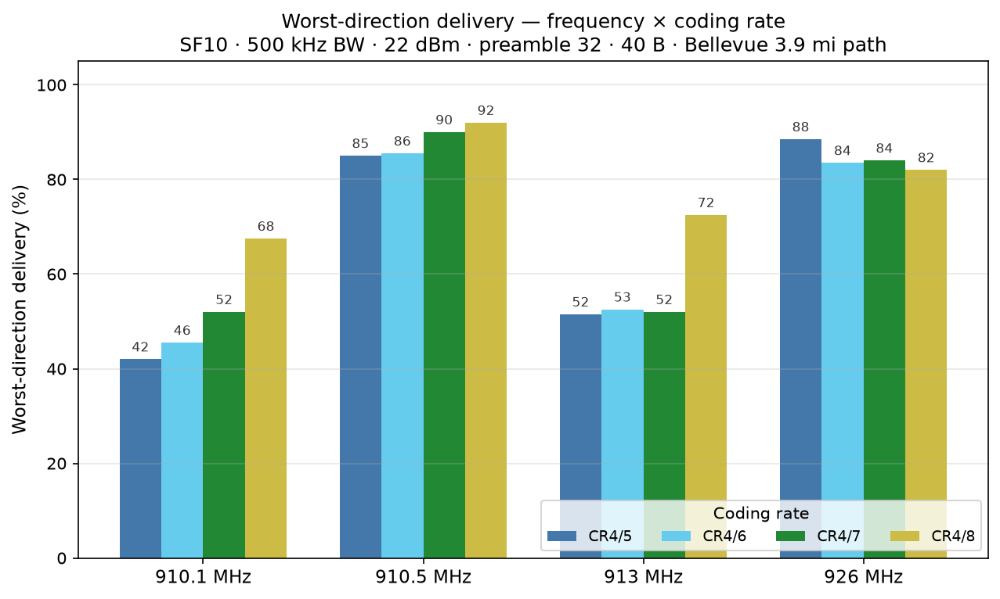
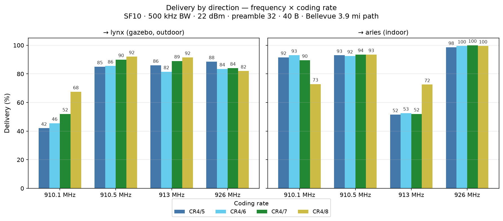
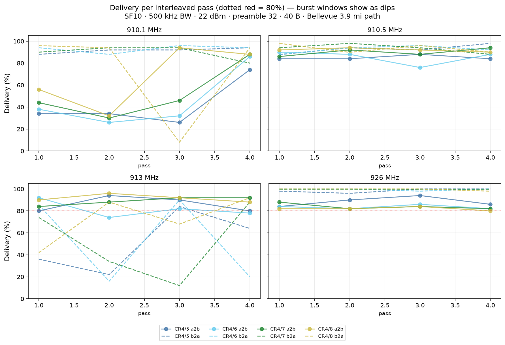
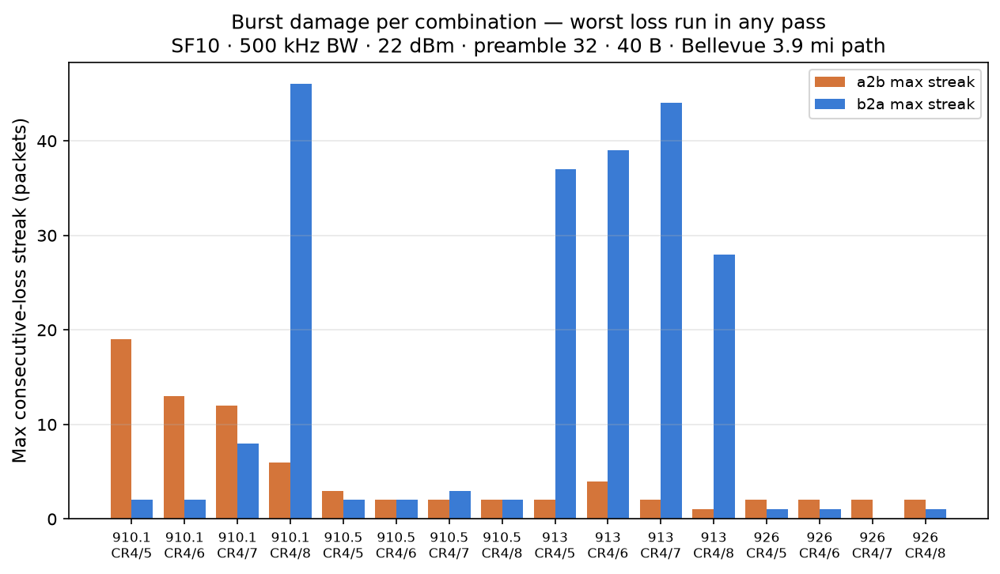

# CR selection round 2 at 910.5 / 913.0 (+910.1 / 926.0 controls) — combined with round 1

**Mesh:** NebraskaMesh · **Date:** 2026-09-12 (14:45–16:56 CDT) · **Location:** Bellevue, NE, USA
**Path:** indoor XIAO WIO ↔ gazebo Heltec v4.2, ~3.9 mi — see the [mesh README](../README.md)
**Companion campaign:** [2026-09-12-cr-selection](../2026-09-12-cr-selection/) (same design, morning) — that report is left
untouched; **this report carries the combined view** of both campaigns.

## TL;DR

- **Question:** same freq × CR design as the morning campaign, at **910.5**
  and **913.0** (with 910.1/926.0 rerun as same-session controls), then
  combined with the morning data for a complete picture.
- **910.5 is the best cell measured all day: 85–92% worst-direction at every
  CR, streaks ≤3, burst-free across all 4 passes.** Big caveat: it sits
  directly on the current 910.525/62.5 kHz default channel — propagation is
  not its problem, coexistence with default traffic is.
- **913.0 behaves exactly like the 909/910 ridge:** a2b healthy (81–92%), b2a
  burst-wiped (worst 51.5–72.5%, streaks 28–44). It is also *inside* the
  US915 LoRaWAN ladder (912.75–913.25 covers the 912.9/913.1 channels).
- **The control check is the headline: 910.1 collapsed AM → PM** (89% → 42%
  worst at CR4/5; the burst damage flipped from its b2a to its a2b) while
  926.0 replicated within ±3 points. The roaming burst environment makes
  single-session lower-band rankings unreliable.
- **Combined pooled ranking:** 926.0 (87/84.5/82.5/81.2% at CR4/5–4/8, n=400/cell)
  and 910.5 (92/90/85.5/85%, n=200/cell) on top; 910.1 mid-pack pooled but
  wildly day-dependent; 909.5 / 910.0 / 913.0 burst-hit; 909.5/CR4/8 still
  pathological (31.5%).

## Test setup

Same nodes/path/settings as the morning campaign: `oneway` mode, 40 B payload,
22 dBm, preamble 32, BW 500 kHz, SF10; 16 combinations (4 freqs × CR4/5–4/8),
4 interleaved passes (rotated freq order, alternating CR order), 50/dir per
cell per pass → 200/dir per cell (6,400 trials), ~2 h 10 min.

910.1 and 926.0 are reruns of the morning's cells — same-session controls
that let the combined view day-normalize (lynx's noise floor swings ~6 dB
between sessions and burst windows roam by the hour).

## Results — PM campaign (n=200/dir per cell)

| freq | CR | a2b | b2a | worst | max streaks (a2b/b2a) |
|---|---|---|---|---|---|
| 910.5 | 4/8 | 92.0% | 93.5% | **92.0%** | 2/2 |
| 910.5 | 4/7 | 90.0% | 93.5% | 90.0% | 2/3 |
| 926.0 | 4/5 | 88.5% | 98.5% | 88.5% | 2/1 |
| 910.5 | 4/6 | 85.5% | 92.5% | 85.5% | 2/2 |
| 910.5 | 4/5 | 85.0% | 93.0% | 85.0% | 3/2 |
| 926.0 | 4/7 | 84.0% | 100% | 84.0% | 2/0 |
| 926.0 | 4/6 | 83.5% | 99.5% | 83.5% | 2/1 |
| 926.0 | 4/8 | 82.0% | 99.5% | 82.0% | 2/1 |
| 913.0 | 4/8 | 91.5% | 72.5% | 72.5% | 1/28 |
| 910.1 | 4/8 | 67.5% | 72.9% | 67.5% | 6/46 |
| 913.0 | 4/6 | 81.5% | 52.5% | 52.5% | 4/39 |
| 913.0 | 4/7 | 89.0% | 52.0% | 52.0% | 2/44 |
| 910.1 | 4/7 | 52.0% | 89.5% | 52.0% | 12/8 |
| 913.0 | 4/5 | 86.0% | 51.5% | 51.5% | 2/37 |
| 910.1 | 4/6 | 45.5% | 93.0% | 45.5% | 13/2 |
| 910.1 | 4/5 | 42.0% | 91.5% | 42.0% | 19/2 |

## Combined with the morning campaign

The morning campaign ([2026-09-12-cr-selection](../2026-09-12-cr-selection/))
measured 909.5 / 910.0 / 910.1 / 926.0 with the identical design. Shared cells
(910.1, 926.0 × 4 CRs) pool across both campaigns (n=400/dir); single-day
cells are shown as measured.

### Pooled worst-direction ranking (both campaigns)

| freq | CR | worst | a2b | b2a | streaks | days |
|---|---|---|---|---|---|---|
| 910.5 | 4/8 | **92.0%** | 92.0% | 93.5% | 2/2 | PM |
| 910.5 | 4/7 | **90.0%** | 90.0% | 93.5% | 2/3 | PM |
| 926.0 | 4/5 | **87.0%** | 87.0% | 99.2% | 2/1 | AM+PM |
| 910.5 | 4/6 | 85.5% | 85.5% | 92.5% | 2/2 | PM |
| 910.5 | 4/5 | 85.0% | 85.0% | 93.0% | 3/2 | PM |
| 926.0 | 4/7 | 84.5% | 84.5% | 99.2% | 2/1 | AM+PM |
| 926.0 | 4/6 | 82.5% | 82.5% | 99.0% | 3/1 | AM+PM |
| 926.0 | 4/8 | 81.2% | 81.2% | 99.0% | 3/1 | AM+PM |
| 910.1 | 4/8 | 76.4% | 79.5% | 76.4% | 6/46 | AM+PM |
| 913.0 | 4/8 | 72.5% | 91.5% | 72.5% | 1/28 | PM |
| 910.1 | 4/7 | 72.2% | 72.2% | 75.8% | 12/42 | AM+PM |
| 910.0 | 4/8 | 70.1% | 92.0% | 70.1% | 1/34 | AM |
| 909.5 | 4/7 | 68.0% | 92.5% | 68.0% | 2/49 | AM |
| 909.5 | 4/5 | 67.5% | 73.5% | 67.5% | 25/37 | AM |
| 910.1 | 4/5 | 66.2% | 66.2% | 90.2% | 19/4 | AM+PM |
| 910.1 | 4/6 | 65.5% | 65.5% | 75.2% | 13/40 | AM+PM |
| 909.5 | 4/6 | 64.0% | 91.5% | 64.0% | 2/27 | AM |
| 910.0 | 4/5 | 61.8% | 83.0% | 61.8% | 4/44 | AM |
| 913.0 | 4/6 | 52.5% | 81.5% | 52.5% | 4/39 | PM |
| 910.0 | 4/7 | 52.3% | 89.5% | 52.3% | 2/48 | AM |
| 913.0 | 4/7 | 52.0% | 89.0% | 52.0% | 2/44 | PM |
| 910.0 | 4/6 | 51.8% | 87.5% | 51.8% | 2/34 | AM |
| 913.0 | 4/5 | 51.5% | 86.0% | 51.5% | 2/37 | PM |
| 909.5 | 4/8 | 31.5% | 90.0% | 31.5% | 2/45 | AM |

### Day-over-day check on the shared controls

| cell | AM worst | PM worst | Δ |
|---|---|---|---|
| 926.0 CR4/5 | 85.5% | 88.5% | +3.0 |
| 926.0 CR4/6 | 81.5% | 83.5% | +2.0 |
| 926.0 CR4/7 | 85.0% | 84.0% | −1.0 |
| 926.0 CR4/8 | 80.5% | 82.0% | +1.5 |
| 910.1 CR4/5 | 89.0% | **42.0%** | **−47.0** |
| 910.1 CR4/6 | 57.5% | 45.5% | −12.0 |
| 910.1 CR4/7 | 62.0% | 52.0% | −10.0 |
| 910.1 CR4/8 | 80.0% | 67.5% | −12.5 |

## Findings

1. **910.5 delivered the best numbers of the day at every coding rate — and
   was burst-free for all four passes.** Both directions 85–93%, streaks
   ≤3, no pass-level dips. But it occupies the *same channel as the current
   US/Canada default* (910.525/62.5 kHz sits inside its 910.25–910.75
   window): where default traffic exists, coexistence — not the link —
   becomes its problem, and border-region Canadian meshes live on that
   channel today.
2. **913.0 confirms the burst zone extends past 910:** same signature as
   909.5/910.0 (healthy a2b, b2a shredded by 28–44-packet streaks). And
   unlike 916.4, 913.0 sits *inside* the US915 LoRaWAN ladder. Every
   frequency from 909.5 through 916.9 tested so far has shown burst damage
   in at least one campaign; only 926.0–926.5 and (one session) 910.5
   have been burst-free.
3. **The 910.1 control collapse is the day's most important result.** The
   same cell that won the morning (89%) collapsed to 42% in the afternoon —
   with the damage flipping from b2a to a2b. The burst environment is not
   just diurnal, it *roams across frequencies and directions within a
   single day*. No single-session lower-band ranking should be trusted;
   the pooled 910.1 numbers (66–76%) are averages of two very different
   days, not a stable property.
4. **926.0 replicated for a third consecutive session** (worst 80.5–88.5%,
   b2a 98.5–100%, streaks ≤3, zero burst evidence ever recorded there).
   With n=400/dir pooled across both campaigns it is the most-confirmed
   cell in the dataset, and CR4/5 ≥ CR4/6 ≥ CR4/7 ≥ CR4/8 ordering (lighter
   is never worse) held both days.
5. **CR conclusion sharpens:** on burst-free channels, lighter coding rates
   win or tie at every frequency tested (926.0 pooled: 87.0/82.5/84.5/81.2
   for CR4/5→4/8; 910.5 PM: 85.0/85.5/90.0/92.0 — flat, with CR4/7 and
   CR4/8 nominally ahead). Heavy CR buys nothing where bursts are absent;
   its value is confined to burst-prone channels, where it reduces streak
   length (morning campaign). A single CR must be a compromise; on this
   evidence CR4/5–CR4/7 are all defensible, and CR4/8's airtime premium is
   hard to justify at 926.

## Data

| File | Contents |
|---|---|
| `data/20260912-{194518,201800,205031,212346}-raw.jsonl.gz` | 4 interleaved passes × 1,600 trials (16 combos × 2 dirs × 50) |
| `data/20260912-*-summary.csv` | Per-combination delivery counts per pass |
| `data/cr_report.json` | This campaign's pooled per-cell stats |
| `data/combined_report.json` | Both campaigns pooled (shared cells n=400/dir) |

Driver: `rf-sweep-core-kit/cr_sweep.py` · plots: `cr_plots.py` ·
combined: `cr_combine.py`
