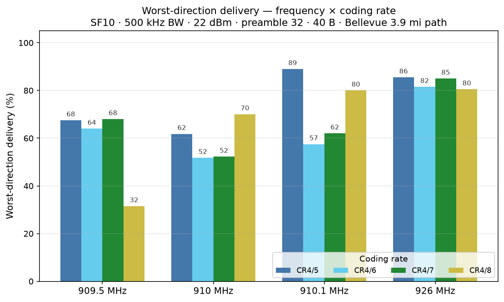
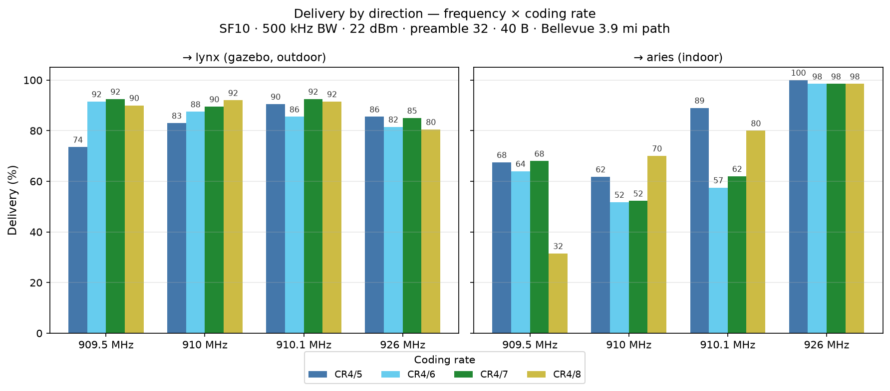
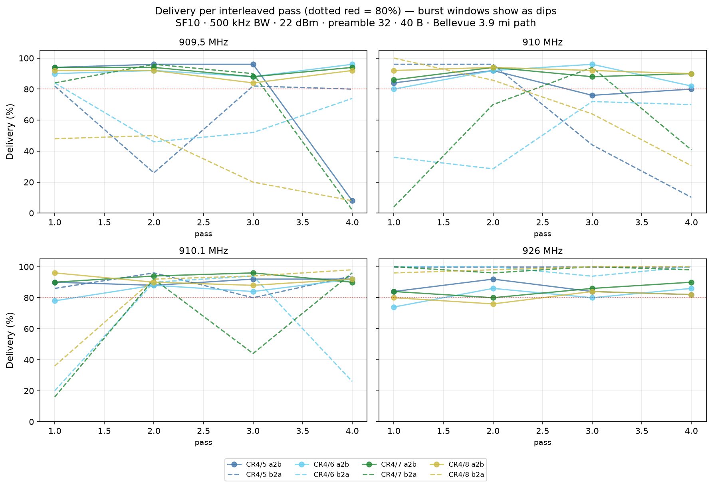
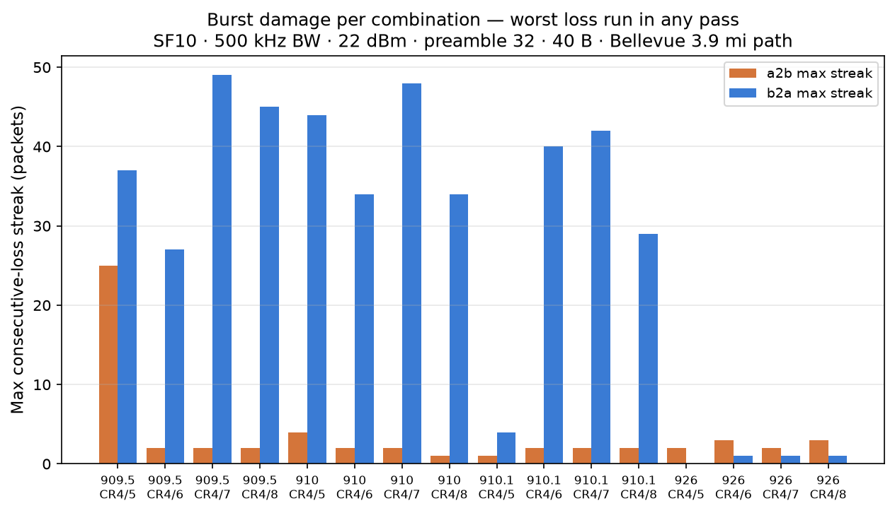
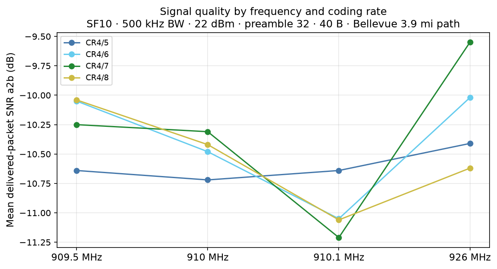

# CR selection at 909.5 / 910.0 / 910.1 / 926.0 — which coding rate earns its airtime?

**Mesh:** NebraskaMesh · **Date:** 2026-09-12 (11:06–13:23 CDT) · **Location:** Bellevue, NE, USA
**Path:** indoor XIAO WIO ↔ gazebo Heltec v4.2, ~3.9 mi — see the [mesh README](../README.md)

## TL;DR

- **Question:** at the four candidate US-preset frequencies, which coding rate
  (CR4/5 → CR4/8) delivers the most without wasting airtime? **Answer: at
  burst-free 926.0, the lighter rates win outright — CR4/8 buys nothing where
  the channel is quiet. In the bursty 909–910 neighborhood, the CR ranking is
  mostly burst-timing noise.**
- **Best cells: 910.1/CR4/5 (89.0% worst-dir) and 926.0/CR4/5 (85.5% worst,
  100% b2a, max streaks 2/0).** At 926.0, CR4/5 through CR4/8 are statistically
  tied (80.5–85.5%) — with zero burst losses at every rate.
- **926.0 confirmed burst-free for a second straight day:** b2a 98–100% in
  every pass at every CR, max streaks ≤3, no burst evidence anywhere.
- **The whole 909–910 neighborhood got hammered again:** b2a max streaks
  27–49 packets at all three lower frequencies. 910.1's pooled lead is partly
  burst-timing luck (its pass-3 b2a dipped to ~80%).
- **New pathological cell:** **909.5/SF10/CR4/8 — 31.5% worst-direction**
  (streak 45), echoing the 909.6/SF10/CR4/8 collapse from the burst-resilience
  campaign. Don't deploy 909.5/CR4/8.
- One whole-pass aries wipe in pass 4 (909.5 a2b 8–10% across CRs) — the
  909.5 environment degraded as the afternoon went on.

## Test setup

Same nodes/path as all prior campaigns. `oneway` mode (unidirectional pings,
passive reception), 40 B payload, 22 dBm, preamble 32, BW 500 kHz, SF10:

- **Swept:** frequency {909.5, 910.0, 910.1, 926.0} × coding rate
  {4/5, 4/6, 4/7, 4/8} — 16 combinations
- **Structure:** 4 interleaved passes with rotated frequency order and
  alternating CR order per pass (burst windows hit all cells fairly)
- **Trials:** 50/dir per cell per pass → **200/dir per cell** (6,400 total)
- Runtime: ~2 h 17 min, unattended

## Results

### Pooled ladder — worst-direction first (n≈200/dir per cell)

| freq | CR | a2b | b2a | worst | max streaks (a2b/b2a) |
|---|---|---|---|---|---|
| 910.1 | 4/5 | 90.5% | 89.0% | **89.0%** | 1/4 |
| 926.0 | 4/5 | 85.5% | 100% | 85.5% | 2/0 |
| 926.0 | 4/7 | 85.0% | 98.5% | 85.0% | 2/1 |
| 926.0 | 4/6 | 81.5% | 98.5% | 81.5% | 3/1 |
| 926.0 | 4/8 | 80.5% | 98.5% | 80.5% | 3/1 |
| 910.1 | 4/8 | 91.5% | 80.0% | 80.0% | 2/29 |
| 910.0 | 4/8 | 92.0% | 70.1% | 70.1% | 1/34 |
| 909.5 | 4/7 | 92.5% | 68.0% | 68.0% | 2/49 |
| 909.5 | 4/5 | 73.5% | 67.5% | 67.5% | 25/37 |
| 909.5 | 4/6 | 91.5% | 64.0% | 64.0% | 2/27 |
| 910.1 | 4/7 | 92.5% | 62.0% | 62.0% | 2/42 |
| 910.0 | 4/5 | 83.0% | 61.8% | 61.8% | 4/44 |
| 910.1 | 4/6 | 85.5% | 57.5% | 57.5% | 2/40 |
| 910.0 | 4/7 | 89.5% | 52.3% | 52.3% | 2/48 |
| 910.0 | 4/6 | 87.5% | 51.8% | 51.8% | 2/34 |
| 909.5 | 4/8 | 90.0% | 31.5% | 31.5% | 2/45 |

### Both directions

The b2a (into aries, indoor) direction absorbed essentially all burst damage
in the 909–910 neighborhood — a2b stayed ≥83% everywhere except one
whole-pass wipe. At 926.0 the familiar inversion holds: b2a is the strong
direction (98–100%) and a2b (80–86%) the weaker one, day 2 in a row.

### Per-pass timeline — burst windows vs stability

The 909–910 panels are sawtoothed: healthy → wiped → healthy, with damage
landing in different passes per cell (interleaving worked). The 926 panel is
flat everywhere except small random a2b variation.

### Burst damage

### Signal quality

Delivered-packet SNR is flat at −10.3 to −11.2 dB across all four
frequencies and all CRs — channel quality is identical; every delivery
difference in this campaign is interference, not signal.

## Findings

1. **On a quiet channel, CR4/8 is wasted airtime.** At 926.0 the CR ladder is
   statistically flat (80.5–85.5% worst-dir at n=200/dir) and CR4/5 — the
   *shortest* packets — nominally leads. This confirms and extends the
   overnight finding: heavy coding rates pay for themselves only when bursts
   or marginal SNR exist. On a clean channel, CR4/5 is the value pick.
2. **The 909–910 ranking is burst-timing, not channel quality.** Pooled
   worst-direction ordering among the lower-band cells tracks which passes
   caught interference windows, not any stable frequency property — 910.1's
   89% lead comes with a pass-3 dip to ~80%, and its b2a streak of 4 was
   luck, not immunity. Treat the entire 909–910 neighborhood as one
   burst-exposed environment.
3. **Second pathological CR4/8 cell found: 909.5/SF10/CR4/8 (31.5% b2a
   pooled).** Combined with 909.6/SF10/CR4/8 (36%) from the burst-resilience
   campaign, two of the three 909.x cells tested have shown a specific
   CR4/8/SF10 collapse, with 909.5 degrading across the afternoon
   (48% → 50% → 20% → 8%). Whatever the mechanism, the pattern "909.x +
   SF10 + CR4/8" is now doubly implicated. OPEN — needs a targeted retest.
4. **926.0 is burst-free for a second day, at every coding rate.** Max
   streak 3 across all 4 passes × 4 CRs; b2a never below 96%. The a2b/b2a
   inversion (80–86% vs 98–100%) persists.
5. **Per-pass interleaving did its job:** pass-to-pass swings of 20–90
   points in the lower band would have ranked frequencies meaninglessly
   under a sequential design.

## Data

| File | Contents |
|---|---|
| `data/20260912-{160620,164052,171527,174922}-raw.jsonl.gz` | 4 interleaved passes × 1,600 trials (16 combos × 2 dirs × 50) |
| `data/20260912-*-summary.csv` | Per-combination delivery counts per pass |
| `data/cr_report.json` | Pooled per-cell stats + per-phase breakdown |

Driver: `rf-sweep-core-kit/cr_sweep.py` · plots: `rf-sweep-core-kit/cr_plots.py`
